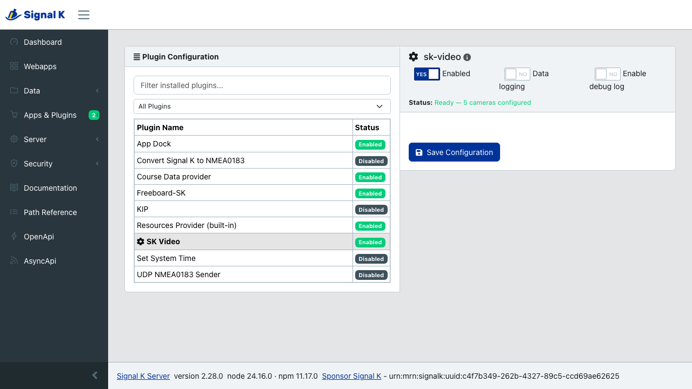

# SK Video

**See your boat's cameras in your browser.**

[](https://github.com/dillan/sk-video/actions/workflows/ci.yml)
[](LICENSE)
[](https://prettier.io)

SK Video is a free add-on (a "plugin") for the [Signal K](https://signalk.org/) server that lets you
watch your onboard IP cameras and saved video clips in [KIP](https://github.com/mxtommy/Kip) and other
Signal K apps — no separate camera app, no cloud account.

<p align="center">
  
</p>

## Why you need it

Web browsers can't open the kind of video most IP cameras produce (`rtsp://` and `rtmp://` streams),
can't talk the "ONVIF" language cameras use, and can't find cameras on your network. SK Video does all
of that on the server, so your browser just gets a picture it can show. In plain terms:

- **Watch RTSP/RTMP cameras** — the common onboard kind — right in your dashboard.
- **Find cameras automatically** — scan the network instead of hunting for IP addresses.
- **Move the camera** — pan, tilt and zoom (PTZ) cameras can be steered from the screen.
- **Keep clips on the boat** — upload videos to the server and play them on any device, with seeking.
- **One setup, every device** — cameras are saved on the boat, so every phone and tablet can use them.

Your **camera logins stay on the boat's server** — they're never copied to your phone or shared
between devices.

## What you'll need

- A [Signal K server](https://github.com/SignalK/signalk-server) running on your boat (for example on
  a Raspberry Pi or a [Cerbo GX](https://www.victronenergy.com/)).
- One or more IP cameras on the same network (most marine and home IP cameras work).
- [KIP](https://github.com/mxtommy/Kip) (or another Signal K app) to view the video.

## Install

**From the Signal K Appstore (easiest):**

1. In your Signal K server, open **Appstore → Available**.
2. Search for **SK Video** and install it.
3. Open **Server → Plugin Config**, find **SK Video**, switch it **On**, and **Submit**.

<p align="center">
  
</p>

**From source (until it's in the Appstore):**

```sh
cd ~/.signalk
npm install dillan/sk-video      # or: npm install /path/to/sk-video
```

Then enable **SK Video** in **Server → Plugin Config** as above.

> The first time you add a camera, the plugin downloads a small helper program
> ([go2rtc](https://github.com/AlexxIT/go2rtc)) once, so the server needs internet access on that
> first run. After that it works offline.

## How to use it

You don't configure cameras in the plugin itself — you do it from the **Video widget** in KIP, which
talks to this plugin for you:

1. Add a **Video** widget to a KIP dashboard.
2. In its settings, set **Source** to **Camera**.
3. **Scan** for cameras, pick one from the list, or **add one by hand** (name, address, and a login if
   the camera needs one).
4. Choose **Standard (HLS)** for everyday viewing or **Low latency (WebRTC)** for docking, and save.

<p align="center">
  
</p>

Step-by-step guides for common setups (foredeck camera, docking view, saving a snapshot with your GPS
position, uploading a clip, and more) are in KIP's built-in help: **Help → Video Recipes**.

## Good to know

- **Cameras are saved as Signal K resources** (a custom `cameras` type), so they're shared across
  every device and app on the boat.
- **Snapshots can include your position and boat data** (GPS, heading, speed, depth, wind) in the
  photo. This is a per-widget choice in KIP, and it's off unless you turn it on — a shared photo would
  otherwise reveal where the boat was.
- **HEVC (H.265) cameras** are supported on a best-effort basis; H.264 cameras (or a camera's H.264
  "sub-stream") give the most reliable picture across devices.

## Troubleshooting

- **"Scan" finds nothing.** Some networks block the discovery broadcast. Add the camera by hand using
  its address (and a path like `/stream1` from the camera's manual).
- **Picture won't load.** Double-check the camera's address and login, and try the other **Delivery**
  option (HLS vs WebRTC).
- **No snapshot photo.** Snapshots need ffmpeg available to the server for some camera types; install
  ffmpeg on the server if your snapshots come back empty.

---

## For developers

SK Video is a TypeScript Signal K plugin. It manages [go2rtc](https://github.com/AlexxIT/go2rtc) to
repackage RTSP/RTMP/ONVIF cameras into browser-playable **WebRTC / HLS / MJPEG**, exposes cameras
through the Signal K [Resources API](https://demo.signalk.org/documentation/develop/rest-api/resources_api.html)
as a custom `cameras` type, proxies **ONVIF PTZ**, runs **WS-Discovery + mDNS**, and stores/serves
uploaded video with HTTP range requests.

### HTTP endpoints (under `/plugins/sk-video`)

| Method                | Path                                         | Purpose                                    |
| --------------------- | -------------------------------------------- | ------------------------------------------ |
| `GET`                 | `/status`                                    | plugin health                              |
| `POST`/`DELETE`       | `/cameras/:id/credentials`                   | write-only camera login (never read back)  |
| `POST`                | `/cameras/:id/whep`                          | WebRTC (WHEP) signaling                    |
| `GET`                 | `/cameras/:id/stream.m3u8`                   | HLS playlist                               |
| `GET`                 | `/cameras/:id/frame.jpeg`                    | snapshot frame                             |
| `POST`/`GET`          | `/cameras/:id/ptz[/stop\|/presets\|/preset]` | ONVIF PTZ                                  |
| `GET`                 | `/cameras/discover`                          | scan the LAN for cameras (rate-limited)    |
| `POST`/`GET`/`DELETE` | `/videos[/:id]`                              | upload / list / play (HTTP Range) / delete |

Camera definitions live at `/signalk/v2/api/resources/cameras`. All browser traffic is same-origin
through the plugin proxy — the browser never reaches go2rtc or a camera directly.

### Security

Built-in defenses include a stream-scheme allow-list (blocks go2rtc `exec:`/`ffmpeg:` sources), an
SSRF egress guard with DNS-rebinding protection, the go2rtc API bound to loopback, owner-only
credential/config files, redaction of credentials from logs, PTZ velocity/token validation, magic-byte
validation of uploads, and vetted HTTP Range handling.

### Develop

You need [Node](https://nodejs.org/) (see [`.nvmrc`](.nvmrc) for the version we use — `nvm use`
picks it up) and Git. Then:

```sh
git clone https://github.com/dillan/sk-video.git
cd sk-video
npm install
npm run build      # compile TypeScript to dist/
npm test           # run the unit tests once
```

Common scripts:

| Script                  | What it does                                           |
| ----------------------- | ------------------------------------------------------ |
| `npm run dev`           | Recompile automatically as you edit (`tsc --watch`)    |
| `npm test`              | Run the unit tests once                                |
| `npm run test:watch`    | Re-run tests as you edit                               |
| `npm run test:coverage` | Run the tests and report coverage                      |
| `npm run lint`          | Check for code problems with ESLint                    |
| `npm run format`        | Auto-format the code with Prettier                     |
| `npm run format:check`  | Check formatting without changing files (what CI does) |

### Run your changes against a Signal K server

The quickest loop is to link your working copy into a Signal K server so it loads the plugin straight
from `dist/`:

```sh
# one time: point the server's plugin folder at this repo
cd ~/.signalk/node_modules        # create the folder if it doesn't exist
ln -s /path/to/sk-video sk-video

# then, while developing:
cd /path/to/sk-video
npm run dev                        # keep rebuilding dist/ as you edit
```

Restart the Signal K server (or toggle the plugin off/on in **Server → Plugin Config**) to pick up a
rebuild. Prefer not to symlink? `npm install /path/to/sk-video` from `~/.signalk` copies it in instead
— just reinstall after each build.

For a full, throwaway stack (a simulated camera, a real Signal K server and a browser), use the
end-to-end harness below — it needs nothing installed on your machine except Docker.

### End-to-end harness

`e2e/` contains a reproducible Docker + Playwright harness (a simulated camera via MediaMTX, the plugin
under a real Signal K server, and an opt-in virtual ONVIF device). See [`e2e/README.md`](e2e/README.md).
It also runs in CI on every push and pull request.

## Contributing

Bug reports, ideas, and pull requests are welcome. See [CONTRIBUTING.md](CONTRIBUTING.md) for the
setup, the checks to run, and our commit-message format. Agents (and the curious) can read
[AGENTS.md](AGENTS.md) for a map of the codebase and its conventions.

## License

MIT
