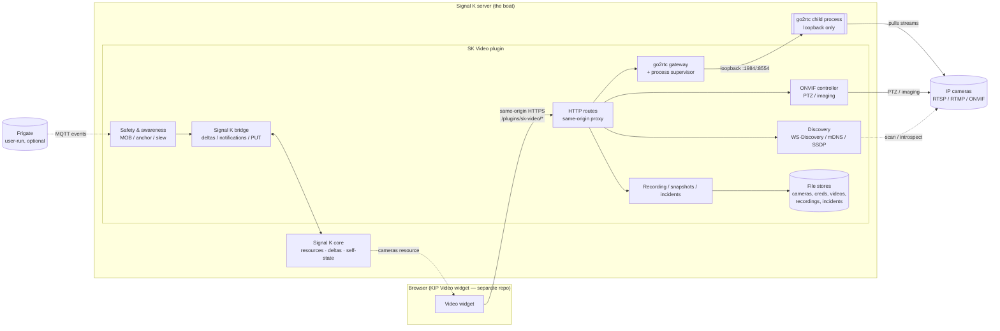
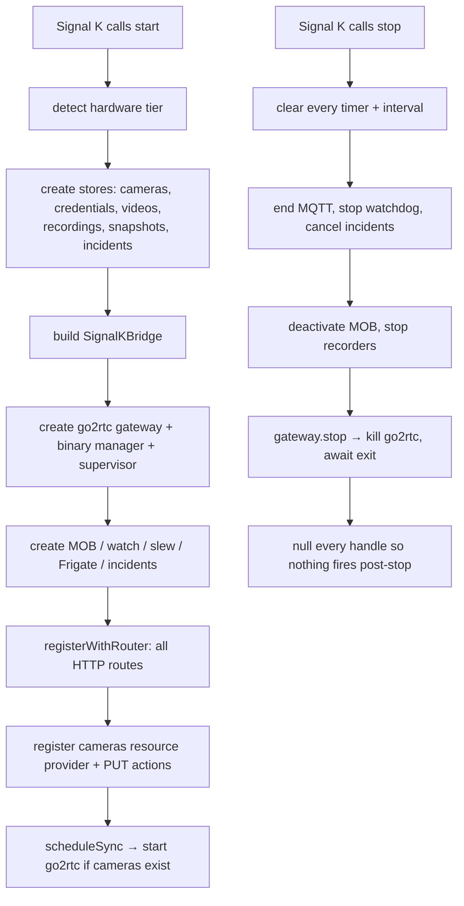

# Architecture overview

> **New contributor? Start here.** This page is the map. Once you can see how the pieces fit, the rest
> of the developer docs zoom into one flow each. None of this assumes you've worked with Signal K or
> go2rtc before.

SK Video is a **Signal K server plugin** written in TypeScript. `src/index.ts` exports the standard
plugin shape:

```ts
export = (app: ServerAPI): Plugin => ({ id, name, schema, start, stop, registerWithRouter, ... })
```

`start()` wires everything up; `stop()` tears it all down. Almost every module is a small, pure,
unit-tested piece with its I/O injected — the entrypoint is the thin glue that connects them to the
real server, the real go2rtc process, and the real filesystem.

---

## The big picture

Browsers can't open `rtsp://` streams, can't speak ONVIF, and can't find cameras. SK Video does all of
that **on the server** and hands the browser something it _can_ play — same-origin, with credentials
staying on the boat.



Two invariants jump out of that diagram, and they're load-bearing:

1. **The browser only ever talks to the plugin.** It never reaches go2rtc (`:1984`) or a camera IP. A
   client-supplied `src=` is never honored. Everything is proxied by an internal camera id.
2. **go2rtc is bound to loopback.** Only the plugin can reach it.

See the [security model](security-model.md) for the full list of invariants.

---

## Subsystems

Each lives in its own `src/` directory and is mostly independent. The entrypoint composes them.

| Directory        | Responsibility                                                                                              | Deep-dive                                                       |
| ---------------- | ----------------------------------------------------------------------------------------------------------- | --------------------------------------------------------------- |
| `src/gateway/`   | Manage the **go2rtc** child process and proxy WebRTC/HLS/MJPEG/frame same-origin; stream health + watchdog. | [Streaming pipeline](streaming-pipeline.md)                     |
| `src/onvif/`     | ONVIF PTZ, imaging presets, capability probe, connection.                                                   | [Streaming pipeline](streaming-pipeline.md)                     |
| `src/discovery/` | WS-Discovery, mDNS, SSDP; zero-typing introspection; device hints.                                          | [Discovery & onboarding](discovery-and-onboarding.md)           |
| `src/cameras/`   | The `cameras` resource model + validation, the camera & credential stores.                                  | [Storage & data](storage-and-data.md)                           |
| `src/recording/` | DVR recording manager + position-stamped snapshots + their stores.                                          | [Storage & data](storage-and-data.md)                           |
| `src/incidents/` | Event bundles: pre/post-roll clip + telemetry track + snapshots.                                            | [Storage & data](storage-and-data.md)                           |
| `src/safety/`    | Man-overboard, anchor-watch, experimental visual refine, geo math.                                          | [Safety & awareness](safety-and-awareness.md)                   |
| `src/awareness/` | AIS targets, CPA, slew-to-cue (shares the MOB geo engine).                                                  | [Safety & awareness](safety-and-awareness.md)                   |
| `src/analytics/` | Frigate MQTT client + cached clips.                                                                         | [Safety & awareness](safety-and-awareness.md)                   |
| `src/uploads/`   | Uploaded-video store, quota, HTTP Range, magic-byte sniff.                                                  | [Storage & data](storage-and-data.md)                           |
| `src/signalk/`   | The bridge: deltas, notifications, self-state reads, PUT/action handlers.                                   | this page (below)                                               |
| `src/security/`  | SSRF guard, rate limiter, log redaction, timeouts.                                                          | [Security model](security-model.md)                             |
| `src/hardware/`  | Tier detection (cores/RAM/arch/accelerator) → feature matrix.                                               | [Hardware & performance](../guides/hardware-and-performance.md) |
| `src/util/`      | Small shared helpers (e.g. atomic file writes).                                                             | —                                                               |

`AGENTS.md` at the repo root has a terser, line-level map if you want to grep your way in.

---

## The Signal K bridge

`src/signalk/sk-bridge.ts` is the one place the plugin touches the Signal K server, so the rest of the
code stays testable. It wraps:

- **Deltas** (`app.handleMessage`) — publish values like `navigation.mob.position`.
- **Notifications** (`app.notifications.raise/update/clear`) — alarms for MOB, anchor-watch, the
  watchdog, Frigate. It **feature-detects and degrades**: on a server with no notifications API (or one
  that throws), it falls back to a `notifications.*` delta instead of taking down a safety path.
- **Self-state reads** (`getSelfPath`/streambundle) — position, heading, SOG, COG, depth, wind — read
  with their data-age so the code can be honest about stale fixes.
- **PUT/action handlers** (`registerPutHandler`) — e.g. the MOB trigger. These **inherit the server's
  auth**; there's no unauthenticated safety trigger.

The Signal K API surface varies by server version, so the bridge probes for what's available rather
than assuming it.

---

## Lifecycle: start and stop

`start()` builds the subsystems and registers routes; `stop()` must put everything back exactly. Getting
teardown right matters on a boat that reloads the plugin on every config change — a leaked timer, child
process, or subscription would survive a reload and double-fire.



go2rtc's own supervisor is a small state machine of its own — see the lifecycle diagram in
[the streaming pipeline](streaming-pipeline.md#go2rtc-process-lifecycle).

---

## How to read the rest of the docs

- Want to know how a camera becomes a picture? → [Streaming pipeline](streaming-pipeline.md)
- Curious about MOB / AIS pointing? → [Safety & awareness](safety-and-awareness.md)
- How does "scan" work? → [Discovery & onboarding](discovery-and-onboarding.md)
- What must every change keep true? → [Security model](security-model.md)
- Where does data live and how can a full disk _not_ brick the server? → [Storage & data](storage-and-data.md)
