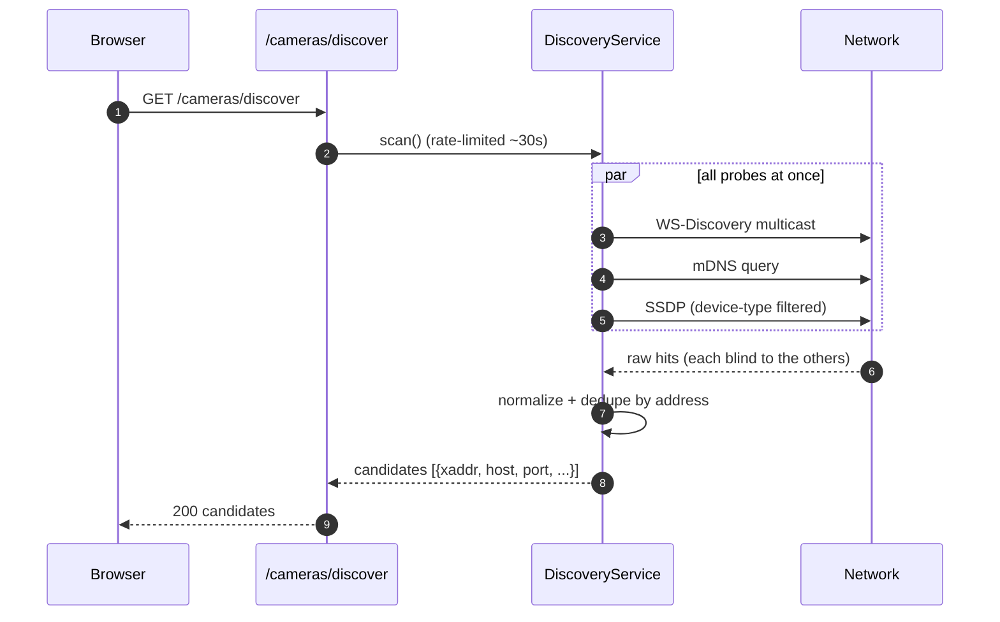
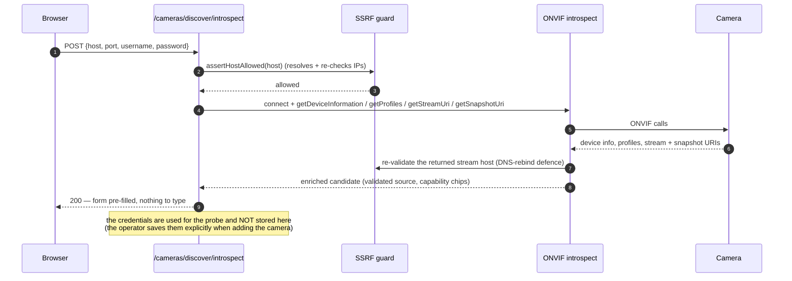

# Discovery & onboarding

How "Scan" finds cameras, and how the zero-typing flow fills the form in for you. The goal is the
biggest possible reduction in helm workload: a boater shouldn't have to hand-type vendor RTSP paths.

---

## The cast

| Piece              | File                                                         | Role                                                    |
| ------------------ | ------------------------------------------------------------ | ------------------------------------------------------- |
| Discovery service  | `src/discovery/discovery-service.ts`                         | Runs the probes, dedupes, normalizes, throttles.        |
| WS-Discovery probe | `src/discovery/ws-discovery-probe.ts`                        | ONVIF multicast probe (`resolve:false` — see below).    |
| mDNS probe         | `src/discovery/mdns-probe.ts`                                | Bonjour/Avahi service discovery.                        |
| SSDP probe         | `src/discovery/ssdp-probe.ts`                                | UPnP, strictly device-type-filtered.                    |
| Normalizer         | `src/discovery/normalize.ts`                                 | Raw hits → a uniform candidate shape.                   |
| Introspect         | `src/discovery/onvif-introspect.ts` + `introspect-routes.ts` | Pull device info / profiles / stream + snapshot URIs.   |
| Device hints       | `src/discovery/device-hints.ts`                              | Curated make/model hints (GoPro, Insta360…).            |
| Placement hints    | `src/discovery/placement-hints.ts`                           | Suggest a friendly name + mount/role from ONVIF scopes. |

---

## Scanning

Each probe searches a different way and is blind to what the others find — running them together is how
you catch a camera one method misses. The scan is **rate-limited**: hammering the network with repeated
multicasts is antisocial and slow.

> **Security note that shapes the code:** the WS-Discovery probe runs with `resolve:false`. With
> `resolve:true`, the ONVIF library would _auto-connect_ to each device's advertised address — a blind
> SSRF to an attacker-controlled host that bypasses the egress guard. So we parse the raw ProbeMatch
> ourselves and re-validate the address through the SSRF guard before anything connects. See the
> [security model](security-model.md).

---

## Zero-typing onboarding

Picking a discovered camera kicks off **introspection**: the plugin connects over ONVIF (with whatever
credentials the user typed, used ephemerally), reads the device's own description, and returns a
pre-filled, already-validated candidate — source URL, snapshot URI, and capability chips.

The address ONVIF hands back (`getStreamUri`) is itself re-validated — a camera can't talk the server
into connecting somewhere it shouldn't.

For non-ONVIF cameras, a curated **RTSP-path library** offers likely paths as _suggestions_, gated
behind the existing `/cameras/test` probe (which is rate-limited and SSRF-guarded). It's always a
suggestion the operator confirms — never authoritative.

---

## A note on the harness

Multicast (WS-Discovery, mDNS) doesn't cross Docker Desktop's bridge on macOS/Windows, so the
[e2e harness](../../e2e/README.md) seeds cameras manually there. Unicast ONVIF (PTZ, introspect) works
fine over the Docker network with the opt-in virtual ONVIF device.
