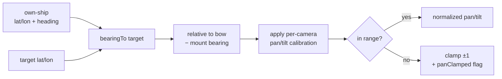
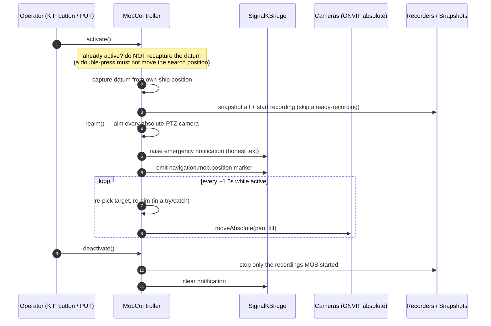
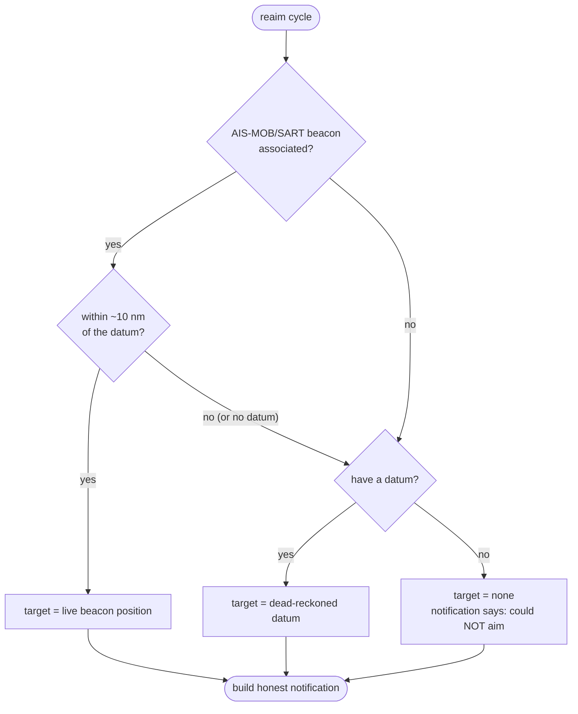
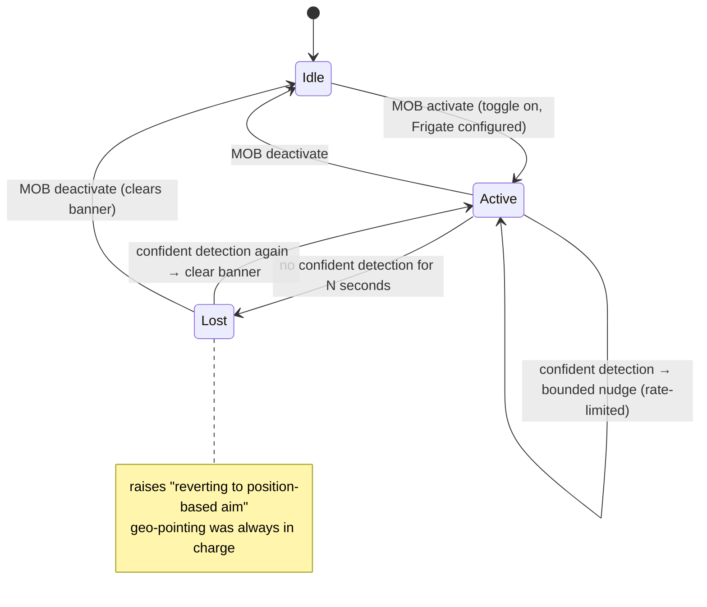
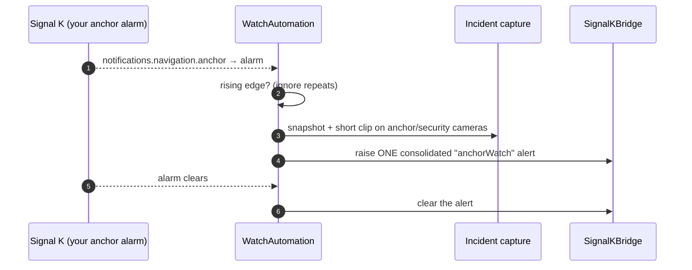
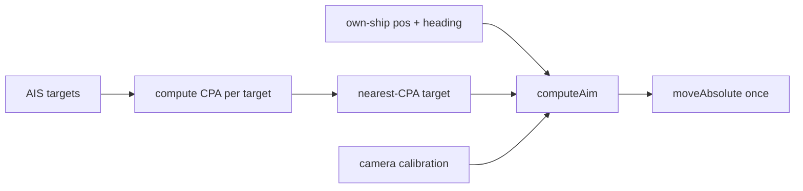

# Safety & awareness flows

Man-overboard, anchor-watch, the experimental visual refine, and AIS slew-to-cue. They share one idea: **geo-pointing** — aim a calibrated absolute-PTZ camera at a real-world position using the boat's position + heading, the target's position, and the camera's calibration. The maths lives once, in `src/safety/mob-geo.ts`, and both MOB and slew-to-cue use it.

> Design north star: these features **support** seamanship and are **honest** about their limits. The code reflects that — it never claims an aim succeeded that didn't, and it degrades loudly, not silently. See the [capability ledger](../reference/capabilities.md).

---

## The geo-pointing core

`computeAim(ownShip, target, cameraAimConfig)` returns a normalized pan/tilt — or `null` when it can't (no calibration, or no heading reference). Key honest details baked in:

- It needs a **heading reference**. True heading if present; otherwise COG, but only when the boat is making way (a course is noise at rest). With neither, it returns `null` and the camera isn't aimed — but the _position_ is still captured.
- A target beyond the camera's pan range comes back **clamped to ±1 and flagged** `panClamped`, so the caller knows the camera is at its mechanical limit, not on the target.

---

## Man-overboard

`src/safety/mob-controller.ts` orchestrates the response; `src/index.ts` wires its I/O (notifications, markers, snapshots, recorders, the `aimCamera` that drives ONVIF absolute moves). A trigger arrives via `POST /mob` **or** the `cameras.mob.activate` Signal K PUT action (which inherits server auth).

### Target priority

The target is re-evaluated every cycle — best source wins. A distress beacon that is implausibly far from the datum is treated as a _different_ incident and ignored (it must not hijack the aim).

The honest-reporting rules that fall out of this: with no fix the message says cameras could **not** be aimed; the `aimedCameras` count excludes pan-clamped cameras and reflects what was _commanded_, not what a (possibly flaky) motor confirmed.

### Experimental visual refine

`src/safety/mob-visual-refine.ts` consumes a Frigate person-detection and produces a **bounded relativeMove nudge** layered on top of the authoritative absolute aim. It is gated to cameras that have **both** absolute PTZ **and** calibration (i.e. ones MOB actually geo-aims), so there's always a baseline underneath. It is rate-limited so a burst of detections can't accumulate drift, and it fails safe:

---

## Anchor-watch

`src/safety/watch-automation.ts` subscribes (through the bridge) to a notification path you already produce, and reacts on the **rising edge** of an alarm. It never computes drag.

---

## Auto low-light after dusk

Both the MOB and anchor-watch flows take an optional `isDark()` + `applyLowLight(ids)` pair. `src/safety/dusk.ts` is a pure solar-geometry helper: `solarAltitudeDeg(date, lat, lon)` (low-precision USNO/NOAA, ~1° accuracy, no ephemeris or network) and `isAfterDusk(...)`. `src/index.ts` computes `isDark` from the boat's own position + the current time — returning `false` when there's no fix, so it never guesses — and `applyLowLight` routes through `ImagingPresetApplier` (`src/onvif/imaging-apply.ts`), which holds a per-camera session baseline so the night preset is idempotent and shares the exact maths the imaging route uses. Only cameras that speak ONVIF imaging are touched; the controllers themselves stay unaware of the clock, so they remain trivially unit-testable.

---

## AIS slew-to-cue

`src/awareness/` parses AIS targets, computes CPA, and reuses `computeAim` to point one camera at the nearest collision-risk vessel. It's a single deterministic aim (re-POST to re-cue), not tracking — and it refuses an uncalibrated or non-absolute-PTZ camera with a `409`.

Because it shares the geo engine with MOB, fixing the maths in one place fixes both — which is exactly why they're built together.
