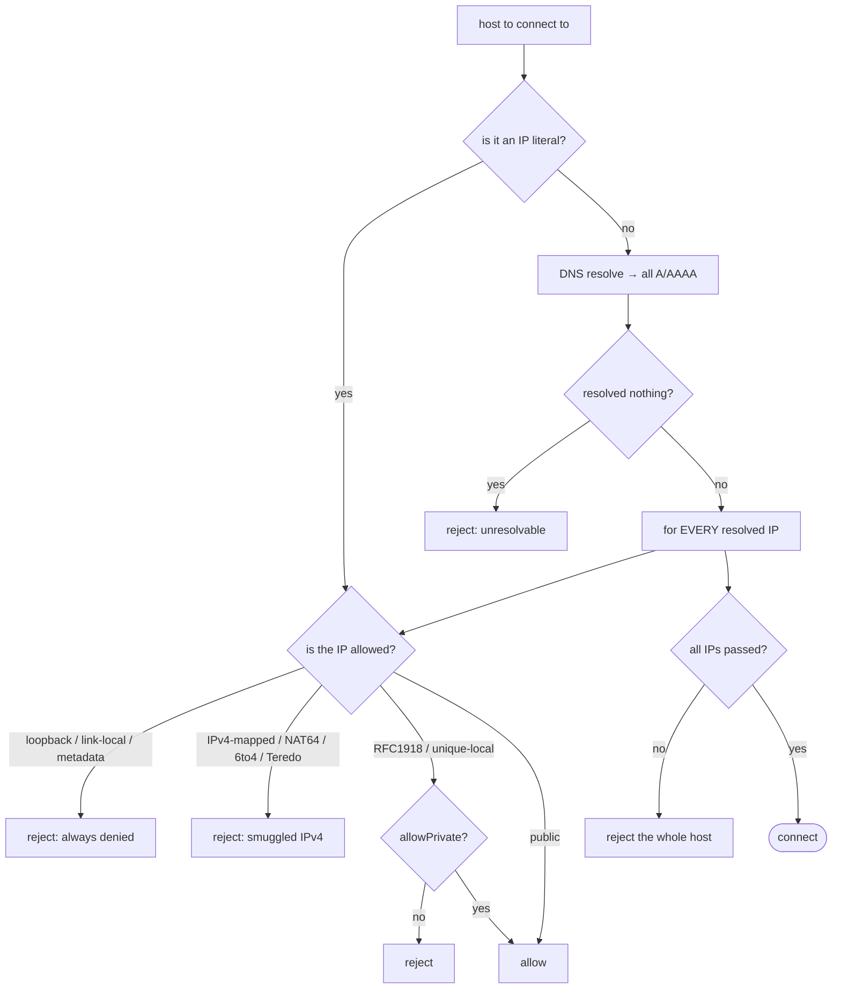
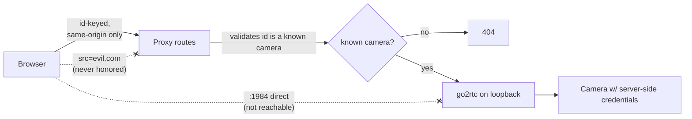

# Security model

The plugin reaches out to cameras on the LAN, runs a child process, downloads a binary, stores
credentials, and serves video to a browser. That's a lot of attack surface for something that runs
unattended on a boat. This page is the contract: **the invariants every change must keep**, and the
mechanisms that enforce them.

> If you're reviewing a PR, this is your checklist. If you're adding a feature, read it first — a new
> route or model field that breaks one of these is a security regression even if all the tests pass.

---

## The invariants

1. **Same-origin only.** The browser never reaches go2rtc (`:1984`) or a camera IP. A client-supplied
   `src=` is never honored. Everything is proxied by an internal camera **id**.
2. **Credentials are server-side, write-only.** They're never in the `cameras` resource, never echoed
   (not even by introspection/auto-fill), and **redacted from every log** (`src/security/redact.ts`).
   Repointing a camera's endpoint drops its stored credentials.
3. **Sources come from validated structured fields** against a scheme **allow-list**
   (`rtsp`/`rtsps`/`rtmp`/`http`/`https`/`onvif`). `exec:`/`ffmpeg:`/`pipe:` and anything else are
   blocked — go2rtc's dangerous source schemes can never be reached.
4. **SSRF egress guard on every outbound host.** Hostnames are resolved and **every** resolved IP must
   pass; loopback, link-local + the cloud-metadata address, and IPv4-embedding IPv6 forms are always
   denied. Any URL ONVIF hands back is re-validated.
5. **`validateCamera` is a security control.** The field set is **closed**; unknown keys and
   credential-looking fields are rejected. Every new model field gets its own validator and is
   optional (no migration).
6. **PUT/action handlers inherit the server's auth.** There's no unauthenticated MOB or snapshot
   trigger.
7. **go2rtc is bound to loopback**, and the binary download is HTTPS from a pinned URL, installed
   atomically.
8. **Brute-forceable routes are rate-limited** (credentials, connection test, introspect, discovery
   scan) — but never the safety trigger (rate-limiting a MOB button could lock out an operator
   mid-incident).

---

## The SSRF guard, step by step

`src/security/ssrf-guard.ts` is the gate for every outbound connection (camera test, ONVIF introspect,
Frigate clip fetch, any URL a camera hands back). It resolves the host and checks **all** addresses — a
name that resolves to even one blocked IP is rejected, which is the DNS-rebind defence.

Cameras live on the LAN, so `allowPrivate` is opted into by the operator — but loopback, link-local,
and the metadata address stay denied **regardless** of that flag.

---

## The same-origin proxy boundary

Why the browser can never reach a camera or go2rtc directly:

The id is validated against the known cameras on every request, so there's nothing to inject — the
browser supplies an id, not a URL.

---

## Other mechanisms at a glance

| Concern                                | Mechanism                                                              | File                                             |
| -------------------------------------- | ---------------------------------------------------------------------- | ------------------------------------------------ |
| Credential leakage in logs             | URL/userinfo redaction                                                 | `src/security/redact.ts`                         |
| Brute force / enumeration              | token-bucket rate limiter                                              | `src/security/rate-limit.ts`                     |
| A stalled dependency hanging a handler | per-call timeouts / `AbortSignal`                                      | `src/security/with-timeout.ts`, loopback fetches |
| Path traversal on stored files         | opaque ids only; `..` rejected; names validated                        | upload/recording/incident stores                 |
| Malicious uploads                      | magic-byte sniff (not the filename/Content-Type)                       | `src/uploads/video-sniff.ts`                     |
| Self-signed marine gear                | **per-camera, explicit** `allowSelfSigned` (never a global verify-off) | `src/onvif/onvif-connect.ts`                     |
| Memory-exhaustion uploads              | streamed to disk with an incremental cap + backpressure                | `src/uploads/file-asset-store.ts`                |
| ffmpeg temp-file races                 | private 0700 temp dir, unguessable names                               | incident clip producer                           |

---

## Known residual risks (documented, not hidden)

Honesty applies to security too. Two narrow items are deliberately not fully closed because the fix
would be worse than the risk for a field deployment:

- **DNS-rebind TOCTOU.** The guard validates every resolved IP, but a connection re-resolves at connect
  time. Fully closing the window means connecting to the pinned IP, a deep change to the HTTP/ONVIF
  clients that risks breaking TLS/ONVIF connectivity. The all-IPs check is a strong mitigation.
- **Route rate-limiting on the safety path.** State-changing routes inherit server auth; we
  deliberately do **not** rate-limit the MOB trigger, because locking out an operator mid-incident is a
  worse failure than the abuse it would prevent.

If you're tightening these, coordinate — they're trade-offs, not oversights.
