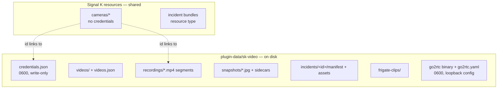
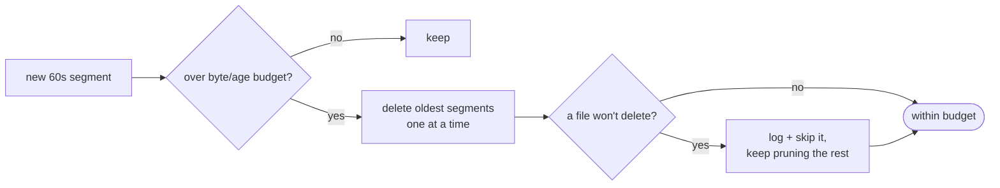
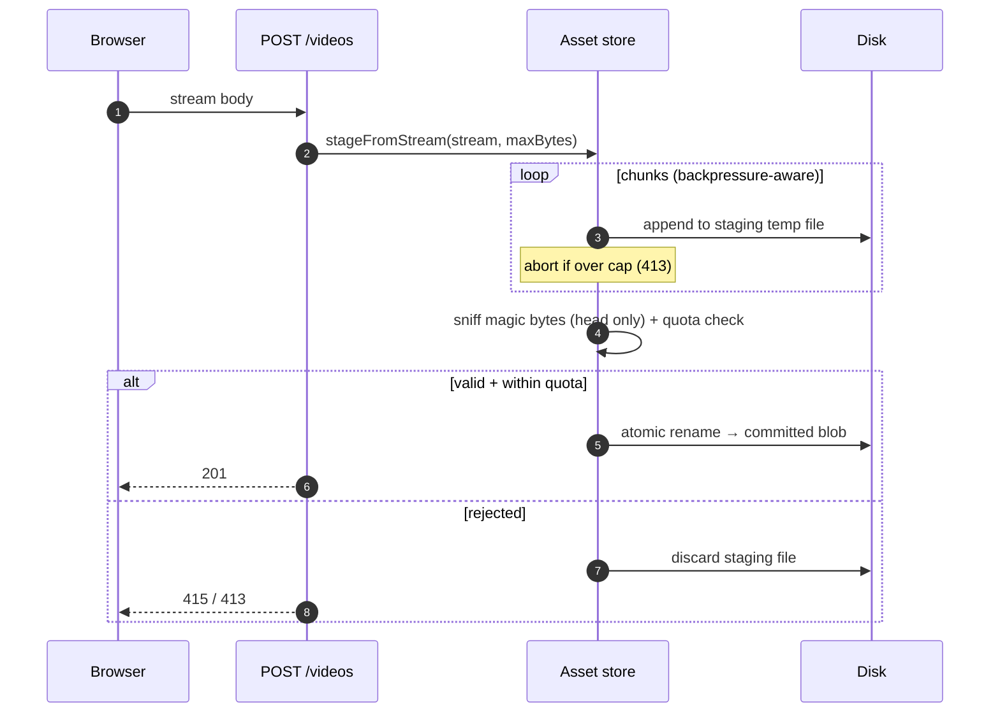

# Storage & data lifecycle

Where everything lives, and the rule that governs all of it: **a full disk can never brick the Signal K server.** Every store is quota-bounded and prunes oldest-first; pruning a bad file never aborts the rest; metadata is written atomically so a power loss can't corrupt the index.

---

## What's stored where

Two homes for data: the **Signal K resource tree** (shared, backed up with the boat's config) and the plugin's **data directory** on disk (`~/.signalk/plugin-data/sk-video/`).

| Data | Home | Quota / pruning |
| --- | --- | --- |
| Cameras | Signal K resource `cameras/*` | n/a (config) |
| Credentials | `credentials.json`, owner-only, write-only | n/a |
| Uploaded videos | `videos/` + index | byte + count quota |
| DVR recordings | rolling `*.mp4` segments | ~10 GB / 48 h, oldest-first |
| Snapshots | `*.jpg` + JSON sidecar | count + age (default 2000 / 30 days) |
| Incident bundles | `incidents/<id>/` (manifest + assets) | byte + count + age; **pinned bundles never pruned** |
| Frigate clips | `frigate-clips/` cache | byte + count quota |

---

## Three rules that keep a boat safe

### 1. Quota-bounded, pruned oldest-first

Every write-heavy store has a budget and a prune pass on a timer. The DVR is the clearest example:

The "skip it, keep going" detail matters: one locked/permission-denied file must **not** abort the sweep, or storage grows past budget until the disk fills.

### 2. Atomic metadata writes

Indexes and manifests (`videos.json`, an incident `manifest.json`, the asset index) are written with `writeFileAtomic` (`src/util/atomic-write.ts`): write a temp sibling, then rename. A same-filesystem rename is atomic, so a reader never sees half a file and a power loss can't truncate the only copy to nothing.

### 3. Streaming, not buffering

A video upload is **streamed straight to a staging file** with an incremental size cap and backpressure, then magic-byte-sniffed, quota-checked, and committed with an atomic rename. The whole body is never held in memory — a single large upload can't OOM-kill the server on a Pi.

---

## Incident bundles: assembled atomically, honest about completeness

An incident is staged under a temp dir and made visible by a **single** rename, so a crash mid-assembly leaves only an orphan staging dir (swept at startup) — the listed/served set never contains a half-written bundle. The manifest records `evidence: 'best-effort'` and downgrades to _partial_ with the failures listed if a clip couldn't be captured. Nothing is ever silently claimed complete.

---

## Lifecycle hooks

- **Startup:** stores load their indexes; the incident store sweeps orphan staging dirs from any earlier crash.
- **On a camera delete:** its stored credentials are dropped too, so a later camera reusing the id can't inherit them.
- **On stop:** prune timers are cleared and notifications are cleared while the bridge is still live (a leaked notification can't be cleared after a reload, since the restarted bridge loses the raise-id).

---

## Serving it back

Stored media (videos, recording segments, incident assets, Frigate clips) is served with **HTTP Range** support (`src/uploads/range.ts`) so a browser can seek without downloading the whole file — `206 Partial Content`, `416` for an unsatisfiable range, `no-store` on the live still frame. The DVR segment listing is cached for a short window so a player's many Range requests don't re-scan the directory each time.

For the DVR scrubber, `GET /recordings/timeline` exposes a derived **timeline contract** (`src/recording/recording-timeline.ts`, types in [the HTTP API reference](../reference/http-api.md#dvr-timeline-contract)). Segments only store a start time + byte size — no per-file duration is probed — so `buildRecordingTimeline()` derives each segment's span (nominal length, capped by the next segment's start, the active one growing from `now`) and emits an explicit **coverage gap** wherever consecutive segments are further apart than that. Pure and unit-tested; the widget mirrors the types.
