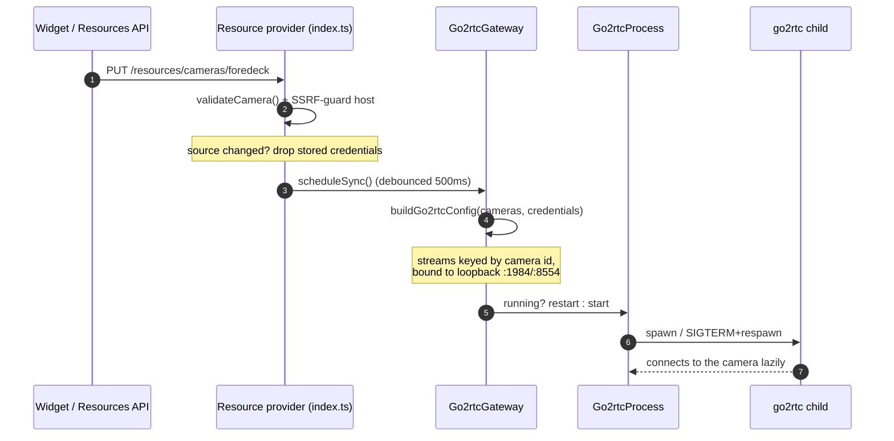
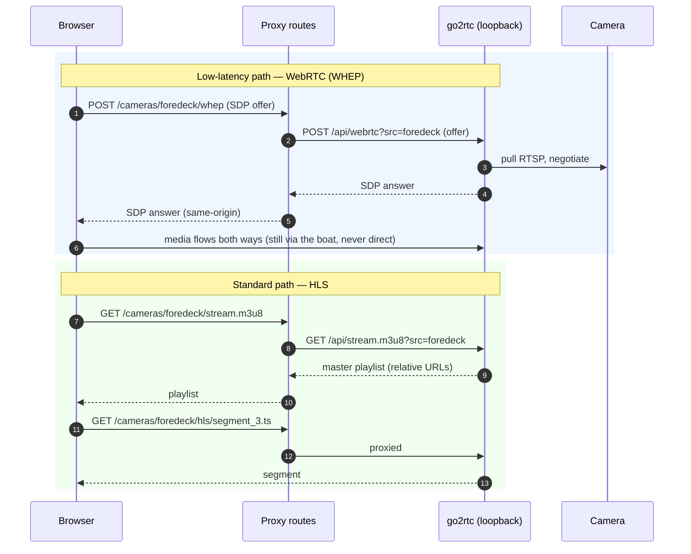
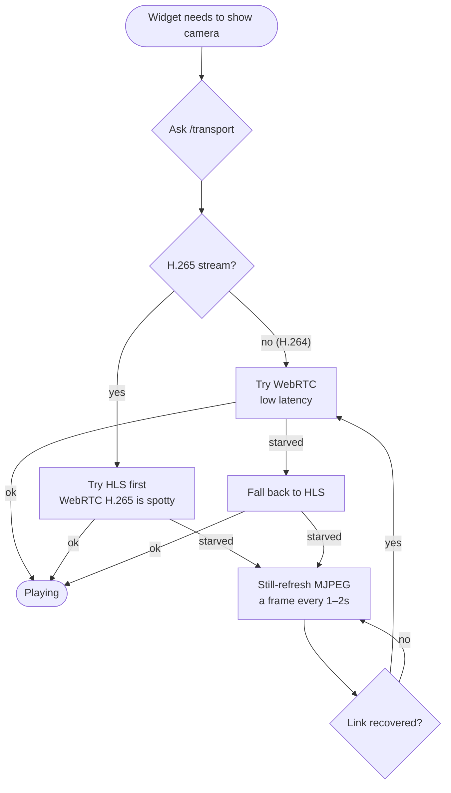
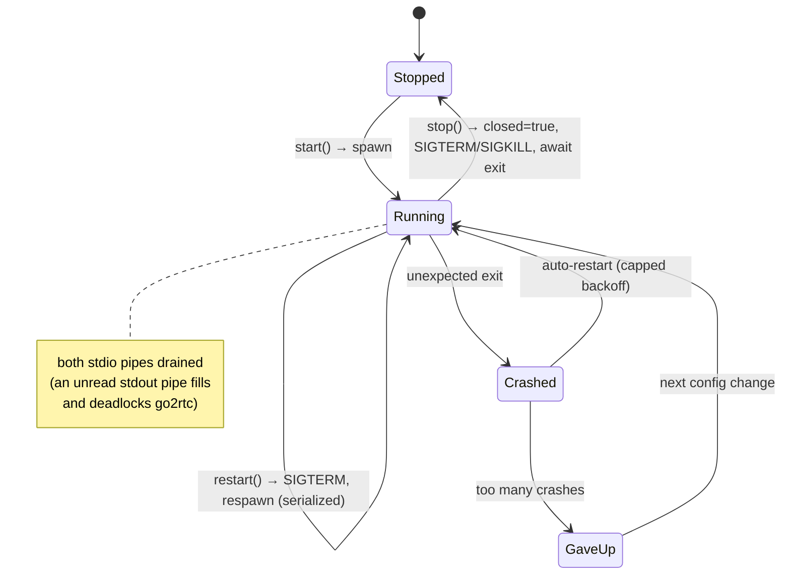
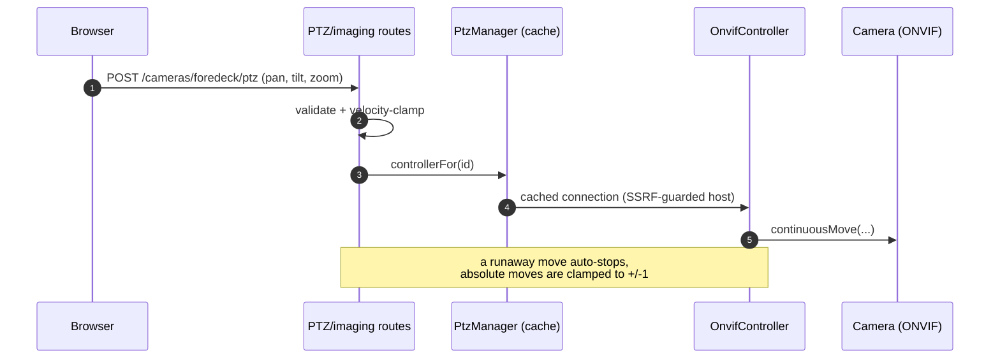

# Streaming pipeline

How an `rtsp://` camera becomes browser-playable video — the single most important flow in the plugin.

The job: browsers can play WebRTC, HLS, and MJPEG, but not the RTSP/RTMP streams cameras produce. SK Video runs **[go2rtc](https://github.com/AlexxIT/go2rtc)** as a child process to do the repackaging, and proxies the browser-facing transports same-origin so credentials never leave the server.

---

## The cast

| Piece | File(s) | Role |
| --- | --- | --- |
| **Gateway** | `src/gateway/go2rtc-gateway.ts` | Reconciles go2rtc's config with the configured cameras. |
| **Config builder** | `src/gateway/go2rtc-config.ts` | Turns cameras + credentials into go2rtc's `streams` config (loopback ports only). |
| **Binary manager** | `src/gateway/go2rtc-binary-manager.ts` | Downloads the pinned go2rtc binary once (atomic install, optional SHA pin). |
| **Process supervisor** | `src/gateway/go2rtc-process.ts` | Spawns/restarts/stops go2rtc; serialized so a restart can't orphan a port-holding process. |
| **Proxy routes** | `src/gateway/go2rtc-proxy-routes.ts` | The same-origin WHEP/HLS/frame/talk/health/transport endpoints. |
| **Stream health** | `src/gateway/stream-health.ts` | Reads go2rtc's `/api/streams` into a redacted DTO. |
| **Watchdog** | `src/gateway/stream-watchdog.ts` | Debounced "safety-critical camera went dark" alarm. |

---

## Adding a camera → go2rtc gets configured

When a camera resource is written, the plugin re-derives go2rtc's config and (re)starts it. The sync is **debounced and serialized** so a burst of edits collapses into one reconcile and two reconciles never run at once.

The browser is never part of this — it just gets an internal camera **id** to ask for.

---

## Watching a camera (WebRTC / HLS)

The browser asks the plugin, the plugin asks go2rtc on loopback, and the answer comes back. The camera id is the only thing the browser knows; a client-supplied `src=` is never honored.

Every loopback fetch carries a **timeout** so a stalled go2rtc can't hang a proxy handler, and the SDP body read is **size-capped** so a client can't stream an unbounded body into memory.

---

## Picking a transport: the fallback walk

`GET /cameras/:id/transport` returns a codec-aware ordering the viewing app can walk down on a bad link and back up when it recovers. There's no server-side transcoding — the order just reflects what's most likely to play.

The walk UX lives in the widget; the plugin only publishes the recommendation + a frame-friendly `Cache-Control: no-store` on the still frame.

---

## go2rtc process lifecycle

The supervisor (`go2rtc-process.ts`) is a small state machine. The hard-won detail: **all** start / restart / stop work is serialized through one promise chain and gated by a `closed` flag, so a restart that's in flight when the plugin tears down can't spawn a fresh go2rtc that outlives `stop()` and keeps holding the loopback ports.

---

## ONVIF: PTZ & imaging

PTZ and imaging are a separate path — they talk ONVIF to the camera directly (server-side), not through go2rtc.

`PtzManager` caches one controller per camera and re-validates the host through the SSRF guard. Imaging presets (Day/Night/Fog/Glare) are capability-gated — the route only applies a control the camera actually reports.

---

## Where to look next

- The proxy's same-origin and credential rules: [Security model](security-model.md).
- How the geo features reuse absolute PTZ: [Safety & awareness](safety-and-awareness.md).
