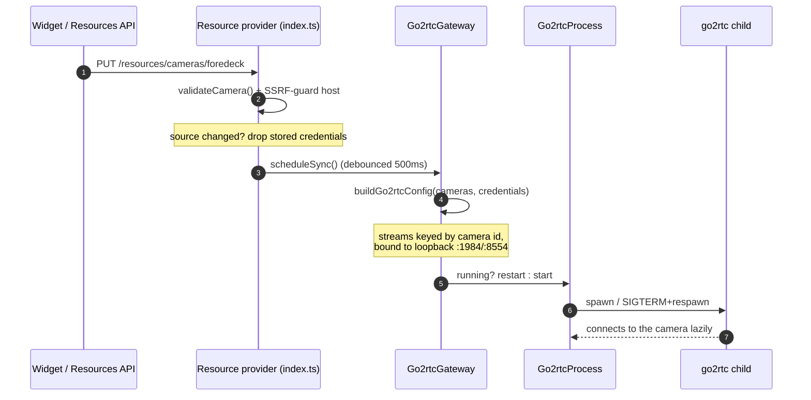
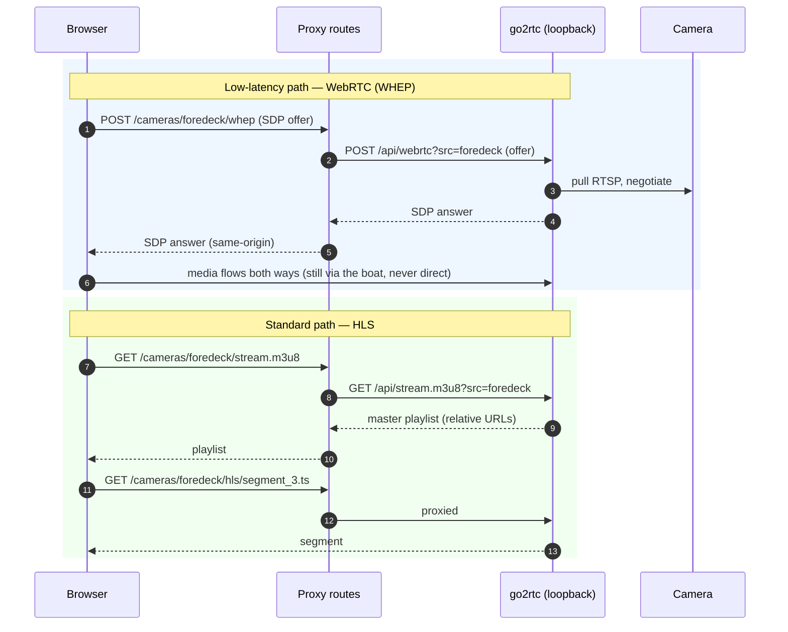
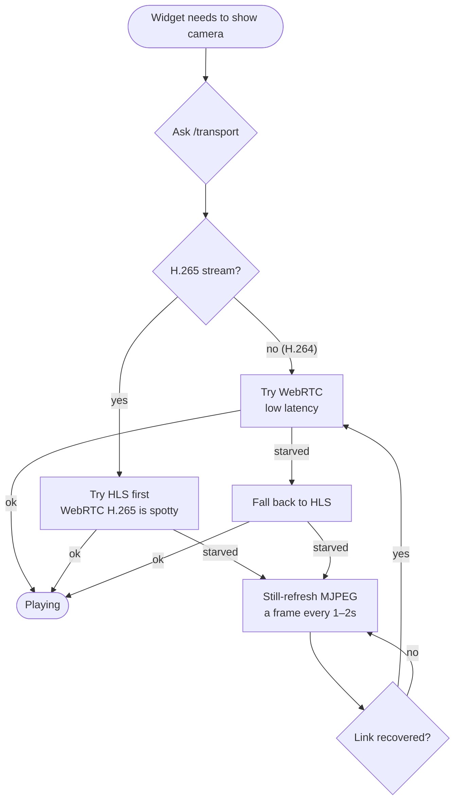
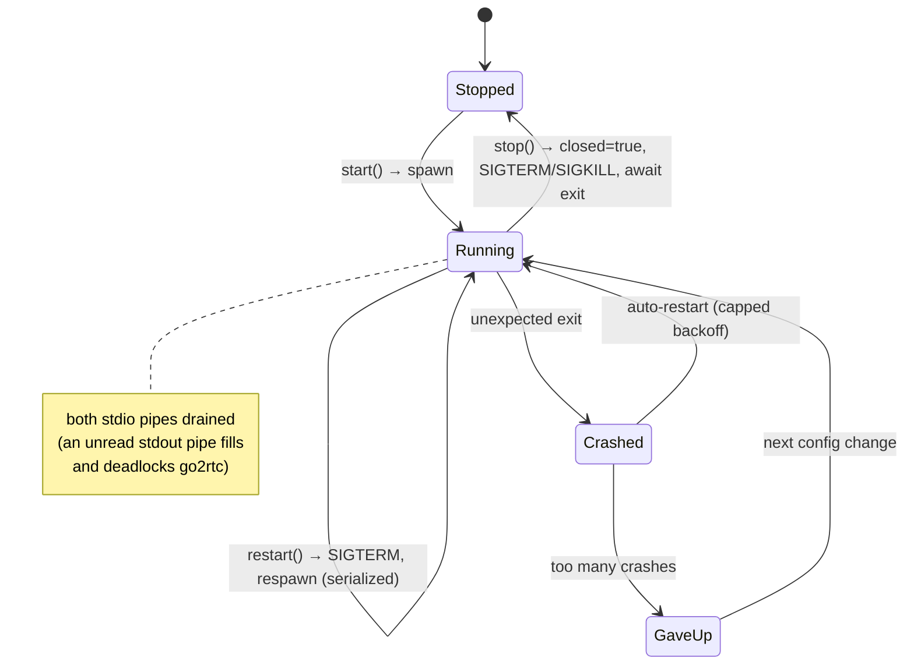
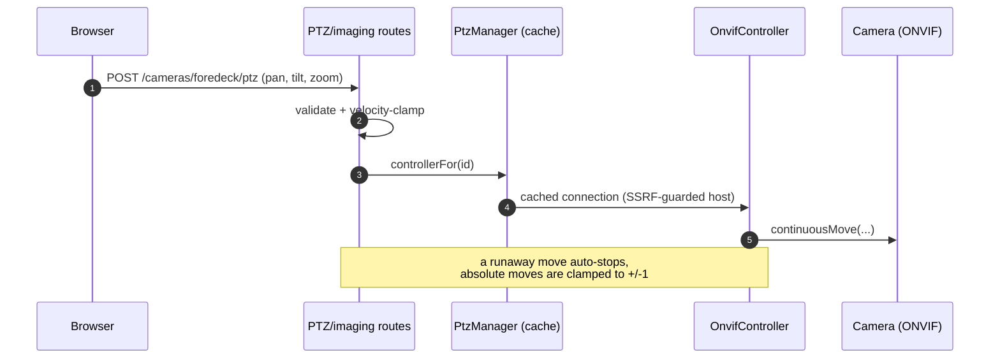

# Streaming pipeline

How an `rtsp://` camera becomes browser-playable video — the single most important flow in the plugin.

The job: browsers can play WebRTC, HLS, and MJPEG, but not the RTSP/RTMP streams cameras produce. SK Video runs **[go2rtc](https://github.com/AlexxIT/go2rtc)** as a child process to do the repackaging, and proxies the browser-facing transports same-origin so credentials never leave the server.

---

## The cast

| Piece | File(s) | Role |
| --- | --- | --- |
| **Gateway** | `src/gateway/go2rtc-gateway.ts` | Reconciles go2rtc's config with the configured cameras. |
| **Config builder** | `src/gateway/go2rtc-config.ts` | Turns cameras + credentials into go2rtc's `streams` config (loopback ports only). |
| **Binary manager** | `src/gateway/go2rtc-binary-manager.ts` | Downloads the pinned go2rtc binary once (atomic install, optional SHA pin). |
| **Process supervisor** | `src/gateway/go2rtc-process.ts` | Spawns/restarts/stops go2rtc; serialized so a restart can't orphan a port-holding process. |
| **Proxy routes** | `src/gateway/go2rtc-proxy-routes.ts` | The same-origin WHEP/HLS/frame/talk/health/transport endpoints. `…/talk` is **auth-gated** (pushing audio out of a speaker is state-changing); the live-view rungs (`whep`/`hls`/`frame`) stay ungated by design. |
| **Stream health** | `src/gateway/stream-health.ts` | Reads go2rtc's `/api/streams` into a redacted DTO. |
| **Watchdog** | `src/gateway/stream-watchdog.ts` | Debounced "safety-critical camera went dark" alarm. |

---

## Adding a camera → go2rtc gets configured

When a camera resource is written, the plugin re-derives go2rtc's config and (re)starts it. The sync is **debounced and serialized** so a burst of edits collapses into one reconcile and two reconciles never run at once.

```mermaid
sequenceDiagram
    autonumber
    participant W as Widget / Resources API
    participant R as Resource provider (index.ts)
    participant G as Go2rtcGateway
    participant P as Go2rtcProcess
    participant X as go2rtc child

    W->>R: PUT /resources/cameras/foredeck
    R->>R: validateCamera() + SSRF-guard host
    Note over R: source changed? drop stored credentials
    R->>G: scheduleSync() (debounced 500ms)
    G->>G: buildGo2rtcConfig(cameras, credentials)
    Note over G: streams keyed by camera id,<br/>bound to loopback :1984/:8554
    G->>P: running? restart : start
    P->>X: spawn / SIGTERM+respawn
    X-->>P: connects to the camera lazily
```

The browser is never part of this — it just gets an internal camera **id** to ask for.

---

## Watching a camera (WebRTC / HLS)

The browser asks the plugin, the plugin asks go2rtc on loopback, and the answer comes back. The camera id is the only thing the browser knows; a client-supplied `src=` is never honored.

```mermaid
sequenceDiagram
    autonumber
    participant B as Browser
    participant R as Proxy routes
    participant X as go2rtc (loopback)
    participant C as Camera

    rect rgb(238,246,255)
    note over B,X: Low-latency path — WebRTC (WHEP)
    B->>R: POST /cameras/foredeck/whep (SDP offer)
    R->>X: POST /api/webrtc?src=foredeck (offer)
    X->>C: pull RTSP, negotiate
    X-->>R: SDP answer
    R-->>B: SDP answer (same-origin)
    B->>X: media flows both ways (still via the boat, never direct)
    end

    rect rgb(240,255,240)
    note over B,X: Standard path — HLS
    B->>R: GET /cameras/foredeck/stream.m3u8
    R->>X: GET /api/stream.m3u8?src=foredeck
    X-->>R: master playlist (relative URLs)
    R-->>B: playlist
    B->>R: GET /cameras/foredeck/hls/segment_3.ts
    R->>X: proxied
    X-->>B: segment
    end
```

Every loopback fetch carries a **timeout** so a stalled go2rtc can't hang a proxy handler, and the SDP body read is **size-capped** so a client can't stream an unbounded body into memory.

---

## Picking a transport: the fallback walk

`GET /cameras/:id/transport` returns a codec-aware ordering the viewing app can walk down on a bad link and back up when it recovers. There's no server-side transcoding — the order just reflects what's most likely to play.

```mermaid
flowchart TD
    Start([Widget needs to show camera]) --> Health{Ask /transport}
    Health --> Codec{H.265 stream?}
    Codec -- "no (H.264)" --> WebRTC[Try WebRTC<br/>low latency]
    Codec -- "yes" --> HLS1[Try HLS first<br/>WebRTC H.265 is spotty]
    WebRTC -- ok --> Play([Playing])
    WebRTC -- starved --> HLS2[Fall back to HLS]
    HLS1 -- ok --> Play
    HLS2 -- ok --> Play
    HLS1 -- starved --> MJPEG[Still-refresh MJPEG<br/>a frame every 1–2s]
    HLS2 -- starved --> MJPEG
    MJPEG --> Recover{Link recovered?}
    Recover -- yes --> WebRTC
    Recover -- no --> MJPEG
```

The walk UX lives in the client; the plugin only publishes the recommendation + a frame-friendly `Cache-Control: no-store` on the still frame. The **SK Video web app** player (`webapp/src/components/VideoPlayer.tsx`) implements the walk with a few marine-network hardenings worth knowing:

- **Recover up, not just down.** The walk falls back on stall/error, but a one-way walk would strand a feed on the 1 fps MJPEG floor after a transient miss (e.g. a go2rtc restart). So when it's below the preferred rung it re-attempts the top rung on a backoff (8 s / 20 s / 45 s, then gives up), and holds there once it sticks. On first run this also lands H.264 cameras back on WebRTC after any early hiccup.
- **Keep the last frame.** During a rung switch it shows the last painted still as a poster, so an upgrade attempt never blanks the video.
- **WHEP ICE gathering.** go2rtc's WHEP is a single non-trickle POST, so the player waits briefly (≤400 ms) for ICE to gather host candidates before POSTing the offer — a candidate-bearing offer connects far more reliably on marina wifi than a bare one relying on peer-reflexive discovery.
- **Fast MJPEG under control.** While a PTZ control is being driven, the still-refresh floor polls `frame.jpeg` at ≈4 fps (vs the ≈1 fps idle cadence) so a move is visible right away, then relaxes.
- **A stall watchdog** on the live rungs walks down if playback stops advancing (a WebRTC that negotiates but never delivers media), rather than only on a hard error.

---

## go2rtc process lifecycle

The supervisor (`go2rtc-process.ts`) is a small state machine. The hard-won detail: **all** start / restart / stop work is serialized through one promise chain and gated by a `closed` flag, so a restart that's in flight when the plugin tears down can't spawn a fresh go2rtc that outlives `stop()` and keeps holding the loopback ports.

```mermaid
stateDiagram-v2
    [*] --> Stopped
    Stopped --> Running: start() → spawn
    Running --> Running: restart() → SIGTERM, respawn (serialized)
    Running --> Stopped: stop() → closed=true, SIGTERM/SIGKILL, await exit
    Running --> Crashed: unexpected exit
    Crashed --> Running: auto-restart (capped backoff)
    Crashed --> GaveUp: too many crashes
    GaveUp --> Running: next config change
    note right of Running
      both stdio pipes drained
      (an unread stdout pipe fills
      and deadlocks go2rtc)
    end note
```

---

## ONVIF: PTZ & imaging

PTZ and imaging are a separate path — they talk ONVIF to the camera directly (server-side), not through go2rtc.

```mermaid
sequenceDiagram
    autonumber
    participant B as Browser
    participant R as PTZ/imaging routes
    participant M as PtzManager (cache)
    participant O as OnvifController
    participant C as Camera (ONVIF)

    B->>R: POST /cameras/foredeck/ptz (pan, tilt, zoom)
    R->>R: validate + velocity-clamp
    R->>M: controllerFor(id)
    M->>O: cached connection (SSRF-guarded host)
    O->>C: continuousMove(...)
    Note over R,O: a runaway move auto-stops,<br/>absolute moves are clamped to +/-1
```

`PtzManager` caches one controller per camera and re-validates the host through the SSRF guard. Imaging presets (Auto/Day/Night/Fog/Glare) are capability-gated — the route only applies a control the camera actually reports.

A few details on this path:

- **ONVIF port probing.** A camera onboarded by its RTSP URL only stored the RTSP port (554); its ONVIF service is a different port. When no ONVIF port is configured the connection layer (`onvif-connect.ts`) probes the common ones (80, 8000, 8899, 2020) and caches the first that completes the handshake — so PTZ "just works" on RTSP-onboarded cameras without extra config.
- **Actionable failures.** `onvif-errors.ts` classifies a failure into `unreachable` / `auth` / `onvif` / `unknown` and the routes return `{ error: <hint>, reason, detail }` (a `502`), so the app can tell the operator _why_ a control failed.
- **Spotlight & alarm** ride ONVIF **auxiliary commands** (`aux-routes.ts` + `aux-commands.ts`): there's no standard ONVIF spotlight/siren, so the advertised aux tokens (e.g. `tt:WhiteLight`) are classified into spotlight/alarm and sent as `<token>|On` / `|Off`. Two-way audio (`/talk`) is a separate WebRTC backchannel negotiated through go2rtc — the browser's mic offer is proxied same-origin to the camera's native audio output.

---

## Where to look next

- The proxy's same-origin and credential rules: [Security model](security-model.md).
- How the geo features reuse absolute PTZ: [Safety & awareness](safety-and-awareness.md).
