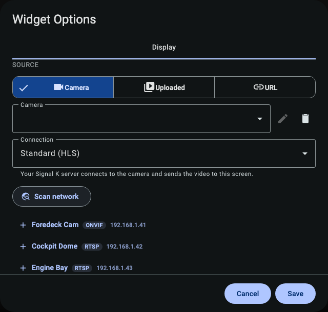
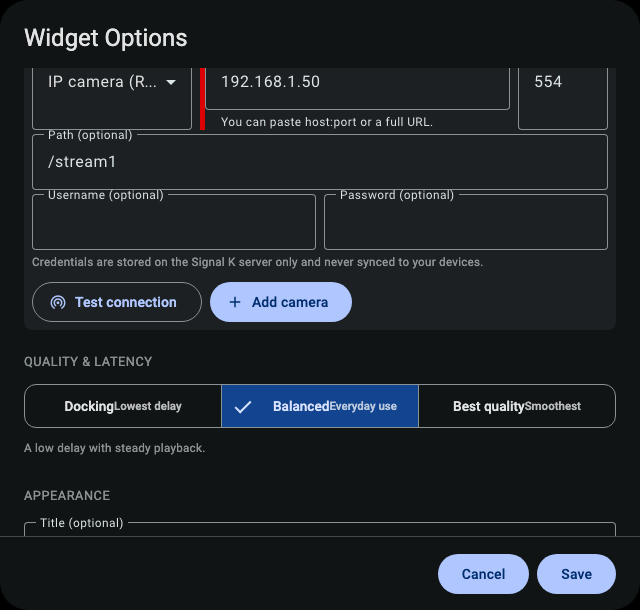

# Adding & organizing cameras

Cameras are added from KIP's **Video widget** settings, and the plugin saves them on the boat so every device shares them. This guide covers the three ways to add a camera, how logins are handled, and how telling the boat _where_ a camera is mounted unlocks the smart features.

---

## Three ways to add a camera

In the Video widget settings, set **Source** to **Camera**. You'll see three source tabs:

  

### 1. Scan (recommended)

Click **Scan**. SK Video broadcasts on the local network and lists any cameras that answer (most modern IP cameras speak **ONVIF** and will show up). Pick one, and the address and stream details are filled in for you — often with **no typing at all**.

  

> Some boat networks block the discovery broadcast (it can't cross certain switches, VLANs, or a Docker bridge). If **Scan** comes up empty but you know the camera's address, add it by hand instead.

### 2. Add a camera by hand

Click **Add a camera** and fill in:

- **Name** — what you'll call it ("Foredeck", "Cockpit"…).
- **Address (host)** — the camera's IP address, e.g. `192.168.1.50`.
- **Port** — usually `554` for RTSP cameras (leave blank to use the default).
- **Path** — the stream path from the camera's manual, e.g. `/stream1` or `/h264Preview_01_main`.

  

If you only have a full stream URL from the camera maker, the **URL** tab accepts an `http(s)://`, `rtsp://`, or `rtmp://` link directly.

### 3. Uploaded clips

The **Uploaded** tab plays videos you've saved to the boat (see [Snapshots & recording](snapshots-and-recording.md)) rather than a live camera — handy for chart briefings or reviewing a saved clip.

---

## Camera logins

If a camera needs a username and password, enter them when you add it. **Logins are stored write-only on the server** — they're saved once, used to reach the camera, and **never read back, shown again, or copied to your phone.** A shared dashboard can't leak them.

If you later point a camera at a different address, the saved login is **automatically discarded** — so a password set for one device can never be sent to another.

---

## Tell the boat where the camera is

This is optional, but it's what turns a plain feed into a smart instrument. In the camera's settings you can record:

- **Mount** — where it physically is: bow, stern, port, starboard, mast, spreader, cockpit, helm, deck, cabin, engine, transom, radar arch, or interior.
- **Bearing** — which way it points, in degrees clockwise from the bow (0 = straight ahead).
- **Role** — what it's _for_: navigation, docking, anchor, security, engine, deck, cockpit, helm, or general.

Why bother?

- **Roles** let an app say "show me the docking cameras" or "show the anchor camera" automatically.
- **Bearing + mount** let the safety features aim a pan/tilt camera at a real-world position — see [Safety features](safety.md) and the **AIS "point at that ship"** tool in [Advanced features](advanced.md).
- **`safety-critical`** marks a camera you want the boat to _watch_ — if it goes dark, you get an alarm. See the watchdog in [Safety features](safety.md).

For the exact list of fields and their allowed values, see the [Camera model reference](../reference/camera-model.md).

---

## A note on camera types & codecs

- **H.264 cameras** (or a camera's H.264 "sub-stream") give the most reliable picture across phones, tablets, and laptops. If your camera has both a main and a sub-stream, the sub-stream is lighter on a weak network.
- **H.265 / HEVC cameras** work on a best-effort basis — browser support is uneven. If an H.265 camera won't play smoothly, try its H.264 sub-stream, or switch the delivery mode (see [Watching video](viewing.md)).
- **360° cameras** are supported as a special projection — see the 360° section in [Advanced features](advanced.md).

---

## Where things are saved

Cameras live as a Signal K **resource** of type `cameras` (at `/signalk/v2/api/resources/cameras`). That means they're part of the boat's shared data: backed up with your Signal K config, visible to every app, and editable through the standard Signal K Resources API if you ever want to script it. Logins are the **only** thing kept separate and private.
