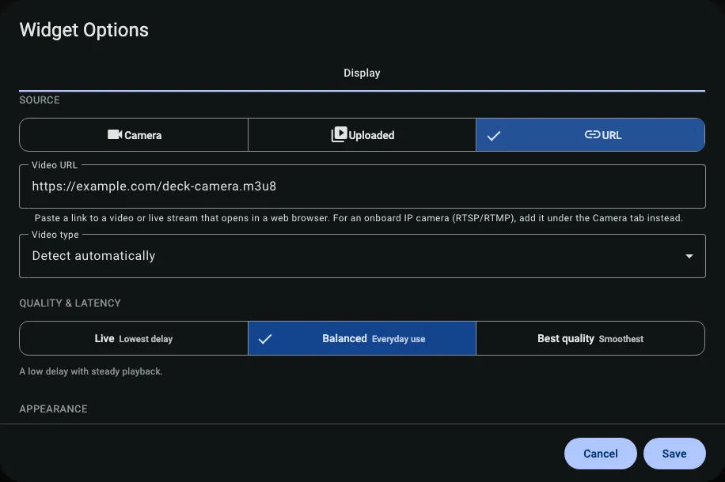
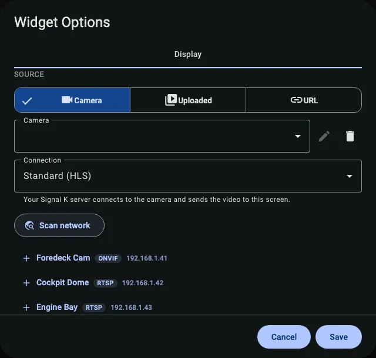
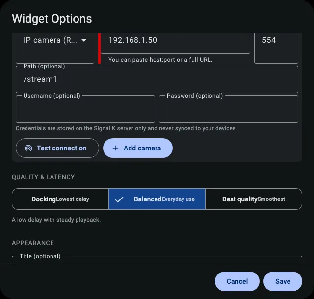
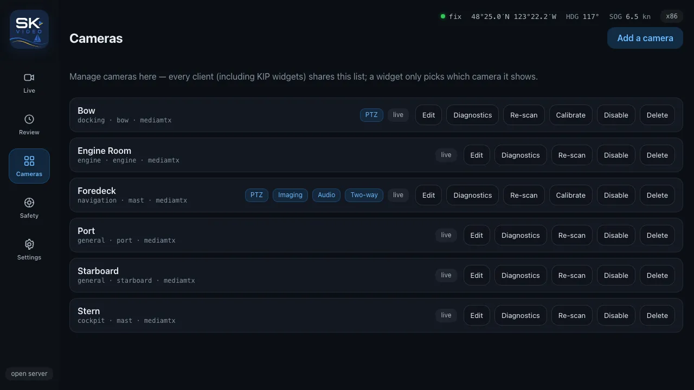

# Adding & organizing cameras

Cameras are managed in the **SK Video app** under **Cameras** (and, if you prefer, from KIP's Video widget). Either way the plugin saves them on the boat so every device shares them. This guide covers the ways to add a camera, how logins are handled, and how telling the boat _where_ a camera is mounted unlocks the smart features. The app is also where you run the **calibration wizard** and check a camera's **health**.

---

## Four ways to add a camera

In the SK Video app, go to **Cameras → Add a camera** (in KIP, set the Video widget **Source** to **Camera**). You'll see three source tabs:

  

### 1. Scan (recommended)

Click **Scan**. SK Video broadcasts on the local network and lists any cameras that answer (most modern IP cameras speak **ONVIF** and will show up). Pick one, and the address and stream details are filled in for you — often with **no typing at all**.

  

> Some boat networks block the discovery broadcast (it can't cross certain switches, VLANs, or a Docker bridge). If **Scan** comes up empty but you know the camera's address, add it by hand instead.

### 2. Add a camera by hand (with or without ONVIF)

Click **Enter address manually** and type the camera's address. The wizard first tries to **read the camera over ONVIF** — when that works you get everything pre-filled (stream, codec, PTZ, imaging) with no further typing.

Not every camera speaks ONVIF (and some hide it on odd ports). If the read fails — or you already know it won't work — pick **No ONVIF? Add as a plain stream**, or go straight to **Paste a stream URL (rtsp://…)** from the first step:

- **Paste a full URL** like `rtsp://192.168.1.50:554/stream1` and the wizard splits it into the right fields. A login embedded in the URL (`rtsp://user:pass@…`) is moved to the camera-login fields and stored **write-only** — it never ends up in the shared camera record.
- **Or fill in the fields**: scheme (`rtsp`, `rtsps`, `rtmp`, `http`, `https`), address, port (usually `554` for RTSP), and the stream path from the camera's manual. Query-string paths (Dahua-style `/cam/realmonitor?channel=1&subtype=0`) work too.
- **Don't know the path?** Enter the make (Hikvision, Reolink, Dahua, Axis, Foscam, Amcrest, Ubiquiti, Vivotek…) and the wizard suggests the vendor's known stream paths to try.
- **Test the stream before saving** — the server probes it for real video, so a wrong address never persists.

A camera added this way saves with no claimed capabilities (nothing was auto-detected — the wizard never guesses). If the camera does speak ONVIF later, **Re-scan** on its row picks up PTZ, imaging, and sub-streams.

  

In the **KIP widget**, the **URL** tab likewise accepts an `http(s)://`, `rtsp://`, or `rtmp://` link directly.

### 3. Action cameras (GoPro / Insta360) — guided setup

Action cameras don't announce themselves on the network (no ONVIF, and they usually run their own WiFi), so **Scan can't find them**. Pick **Action camera (GoPro / Insta360)** in the wizard instead — it walks you through each device step by step, pre-fills what it can, and lets you **test the stream before saving**. Treat them as _temporary_ sources, not a permanent marine install: their live modes are lower-resolution, need external power, and reconnect unreliably.

**Insta360 (X3 / X4 / X5) — the camera serves a stream you pull:**

1. Power the camera and turn on its WiFi — the camera hosts its own access point.
2. Join the **Signal K server's machine** to that WiFi network. The plugin pulls the stream, so the _server_ — not your phone or browser — must reach the camera. A machine with a single WiFi radio leaves the boat network when it joins the camera's; use a second interface for anything beyond a quick session.
3. Keep the camera on external power.
4. The wizard pre-fills the 360 preview address (`rtsp://192.168.42.1:8554/live`) and records the stream as **equirectangular**, so the viewer knows to render a swipe-around spherical view. Test it, then save.

> The WiFi preview is a reverse-engineered, lower-resolution stream (~1440×720) — not the camera's full recording quality.

**GoPro (HERO12 / HERO13) — the camera pushes; you give it a target:**

1. Install the **GoPro Labs** firmware (stock firmware only streams to GoPro's cloud).
2. Run an RTMP server the boat network can reach — e.g. [MediaMTX](https://github.com/bluenviron/mediamtx) on the boat computer. The GoPro **pushes** to it, and SK Video pulls from it.
3. Point the GoPro at your server with a GoPro Labs QR code, e.g. `rtmp://<server-address>:1935/gopro`.
4. Enter that **same** `rtmp://` address in the wizard as the camera source, test it, and save.
5. Start the live stream on the GoPro. Expect to restart it after a drop — Labs RTMP auto-reconnect is limited.

### 4. Uploaded clips

The **Uploaded** tab plays videos you've saved to the boat (see [Snapshots & recording](snapshots-and-recording.md)) rather than a live camera — handy for chart briefings or reviewing a saved clip.

---

## Camera logins

If a camera needs a username and password, enter them when you add it. **Logins are stored write-only on the server** — they're saved once, used to reach the camera, and **never read back, shown again, or copied to your phone.** A shared dashboard can't leak them.

If you later point a camera at a different address, the saved login is **automatically discarded** — so a password set for one device can never be sent to another.

---

## Seeing what a camera supports

When SK Video adds an ONVIF camera it **detects what the camera can do** and shows it as small chips on each row in the **Cameras** list — so you can see at a glance which features are available:

- **PTZ** — pan/tilt/zoom.
- **Imaging** — the Day/Night/Fog/Glare picture presets.
- **Audio** — the camera has a microphone you can listen to.
- **Two-way** — the camera has a speaker for [two-way audio](advanced.md#two-way-audio).
- **H.264 sub** — a lighter sub-stream for weak networks.
- **Spotlight** / **Alarm** — a white-light spotlight or an audible siren, where the camera exposes one.

A plain camera that reports nothing shows no chips — SK Video never claims a capability the camera didn't report. These same chips light up the matching controls in [Camera Focus](viewing.md).

  

## Re-scanning capabilities

Each camera row has a **Re-scan** button. It reconnects to the camera with its stored login, re-detects the capabilities, and updates the camera — **without** deleting and re-adding it, so your name, mount, role, and calibration are kept. Use it when:

- You've **updated the plugin** and want an existing camera to pick up newly-supported controls.
- You **enabled a feature on the camera itself** (e.g. turned on ONVIF, or a spotlight/siren) and want SK Video to notice.

SK Video also **re-scans automatically when a camera's firmware changes.** On start it checks each camera's firmware version; if it differs from what it last recorded, it re-scans that camera on its own. The first time this runs after updating, it backfills capabilities for cameras you added before capability detection existed — so after a plugin update and a restart, your cameras' chips (and controls) refresh themselves.

---

## Tell the boat where the camera is

This is optional, but it's what turns a plain feed into a smart instrument. In the camera's settings you can record:

- **Mount** — where it physically is: bow, stern, port, starboard, mast, spreader, cockpit, helm, deck, cabin, engine, transom, radar arch, or interior.
- **Bearing** — which way it points, in degrees clockwise from the bow (0 = straight ahead).
- **Role** — what it's _for_: navigation, docking, anchor, security, engine, deck, cockpit, helm, or general.

Why bother?

- **Roles** let an app say "show me the docking cameras" or "show the anchor camera" automatically.
- **Bearing + mount** let the safety features aim a pan/tilt camera at a real-world position — see [Safety features](safety.md) and the **AIS "point at that ship"** tool in [Advanced features](advanced.md).
- **`safety-critical`** marks a camera you want the boat to _watch_ — if it goes dark, you get an alarm. See the watchdog in [Safety features](safety.md).

For the exact list of fields and their allowed values, see the [Camera model reference](../reference/camera-model.md).

---

## A note on camera types & codecs

- **H.264 cameras** (or a camera's H.264 "sub-stream") give the most reliable picture across phones, tablets, and laptops. If your camera has both a main and a sub-stream, the sub-stream is lighter on a weak network.
- **H.265 / HEVC cameras** work on a best-effort basis — browser support is uneven. If an H.265 camera won't play smoothly, try its H.264 sub-stream, or switch the delivery mode (see [Watching video](viewing.md)).
- **360° cameras** are supported as a special projection — see the 360° section in [Advanced features](advanced.md).

---

## Where things are saved

Cameras live as a Signal K **resource** of type `cameras` (at `/signalk/v2/api/resources/cameras`). That means they're part of the boat's shared data: backed up with your Signal K config, visible to every app, and editable through the standard Signal K Resources API if you ever want to script it. Logins are the **only** thing kept separate and private.
