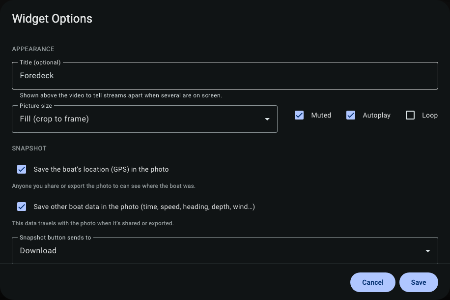
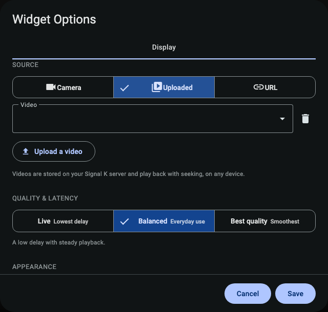

# Snapshots & recording

SK Video can save a still photo from any camera with your **boat's position and data baked in**, record a camera continuously to the boat, and keep a small library of uploaded clips. Everything stays on the boat.

---

## Position-stamped snapshots

Take a snapshot and the plugin writes a photo **plus** a record of where the boat was and what it was doing at that instant: GPS position, heading, speed over ground, depth, and wind. That turns a photo into evidence — "this is what the chartplotter saw, here, at this time."

How the boat data is attached is a per-widget choice in KIP:

- **Off (default)** — just the photo. A shared photo won't reveal where the boat was.
- **Sidecar** — the position/data is saved alongside the photo as a separate record.
- **Burned-in caption** — a small caption is drawn onto the photo itself, e.g. `44°55.1'N · HDG 212° · 0.0 kn · 12:04`.

  

**Honest about missing data.** If there's no GPS fix, the stamp says so — it shows a clear "no fix" / data-age indicator rather than inventing a position. The burned-in caption only ever appears on a saved photo; it never alters the live picture.

> Snapshots are **best-effort**: if the camera frame isn't ready, a snapshot can simply fail and you try again. Some camera types need **ffmpeg** available on the server for snapshots to work — if your snapshots come back empty, installing ffmpeg on the server usually fixes it.

---

## Recording to the boat (DVR)

You can record a camera **continuously** to the boat's storage as a rolling set of short MP4 clips. Start and stop it per camera from the widget.

What to know:

- **It's tier-gated.** Recording needs a bit of muscle. A low-power **Cerbo-class** device offers no recording channels; a **Pi 4** can record a couple of cameras at once; a **small PC** can do several. See [Hardware & performance](hardware-and-performance.md).
- **It can never fill the disk.** Recordings are kept to a budget (about 10 GB and 48 hours by default) and the oldest clips are pruned automatically. A full disk can't brick the Signal K server.
- **Play it back with seeking.** Saved clips stream back to your browser with proper seek/scrub support.

> This is best-effort onboard recording, not a certified marine VDR (voyage data recorder). It's great for "what happened at the dock last night?" — not a legal black box.

---

## Uploading & playing clips

You can upload a video to the boat (a chart briefing, a saved clip) and play it back on any device:

  

- Uploads are checked by their actual file contents (so a renamed non-video can't sneak in) and kept to a storage quota.
- Playback supports **seeking** (HTTP Range), so you can scrub through a long clip without downloading the whole thing.
- Clips show up under the **Uploaded** source tab in the widget.

---

## Incident clips (a step up)

For events worth keeping, SK Video can package a short **before-and-after clip**, a sampled track of the boat's telemetry, and snapshots into a single **incident bundle** — see the incidents section in [Advanced features](advanced.md). The reliable way to capture one is the manual "mark incident" button; it can also fire automatically from your own alarms.

---

## Where to next

- **[Safety features](safety.md)** — anchor-watch automatically captures snapshots and a clip when your anchor alarm fires.
- **[Advanced features](advanced.md)** — incident bundles and Frigate motion clips.
- **[Hardware & performance](hardware-and-performance.md)** — what recording your hardware can sustain.
