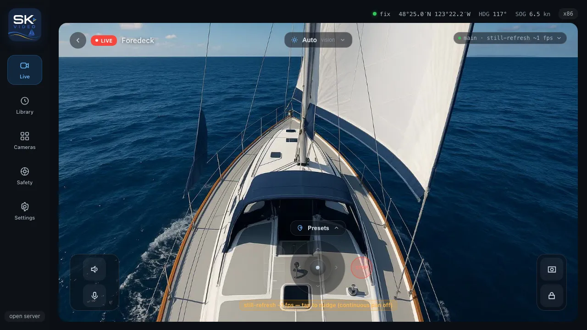
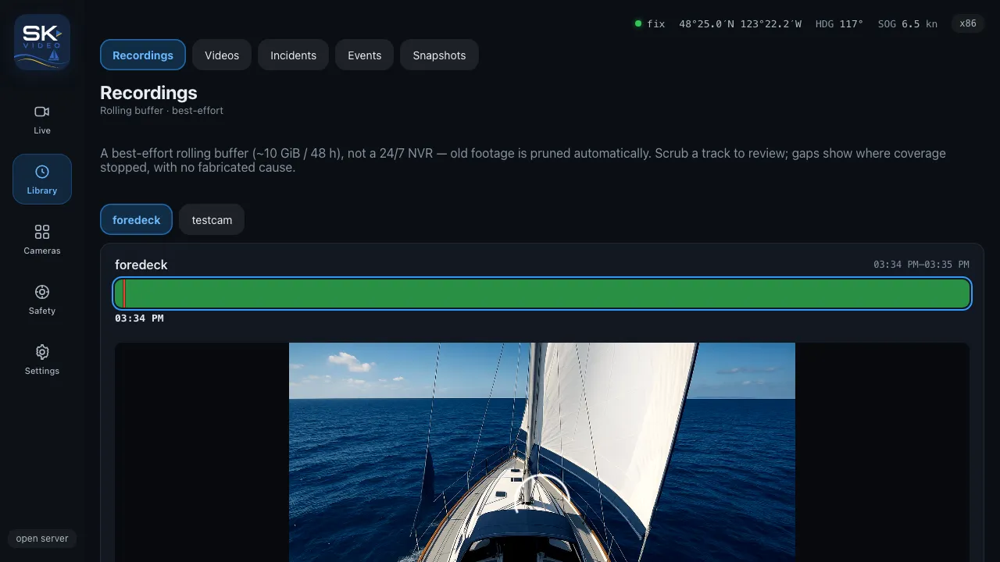
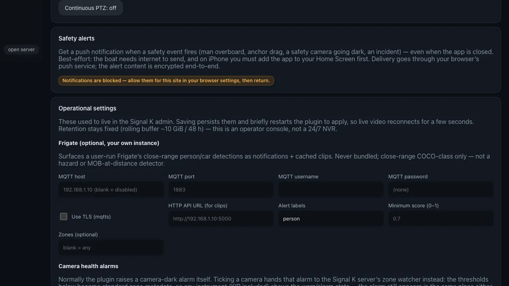

# The SK Video app

SK Video ships its own console — a web app your boat's server hosts, so there's nothing extra to install. It's where you watch live, review footage, run the safety tools, and change settings. It works on a phone, a tablet at the helm, and a laptop at the chart table, and you can install it to your home screen like a native app.

> Prefer KIP? You can still watch cameras in [KIP](https://github.com/mxtommy/Kip)'s Video widget — see [Watching video](viewing.md). Both share the same cameras. This guide is about SK Video's own app.

---

## Opening it

- From the Signal K admin, open the **Webapps** menu and click **SK Video**.
- Or go straight to **`http://<your-server>:3000/sk-video/`**.

  

**Install it (recommended on phones/tablets).** Use your browser's **Add to Home Screen**. Installed, it runs full-screen, launches instantly, keeps its shell working offline, and — on a phone — can deliver safety alerts even when it's closed. Live video and fresh lists always need connectivity; the offline shell is the app frame, not the footage.

The app rides your Signal K login. On an open boat server you're in straight away; on a secured server it uses your existing Signal K session, or shows a sign-in if you're not logged in.

---

## Getting around

A rail (tablet/desktop) or bottom tab bar (phone) gives you five areas:

| Area         | What's there                                                   |
| ------------ | -------------------------------------------------------------- |
| **Live**     | The Live Wall and Camera Focus — your day-to-day viewing.      |
| **Review**   | Recordings, Incidents, Events, Snapshots, and Imported videos. |
| **Cameras**  | Add, scan, edit, calibrate, and check the health of cameras.   |
| **Safety**   | The man-overboard / safety console.                            |
| **Settings** | Themes, density, safety alerts, and operational settings.      |

---

## Live

**Live Wall** is the landing screen: a mosaic of every camera, arranged by where they're mounted. Tiles use the lighter **sub-stream** so a wall of cameras stays smooth even on marina wifi, and each tile is honest about its state — connecting, live, never-seen, or gone dark — rather than showing a frozen frame as if it were live.

Tap a tile to open **Camera Focus** — one camera, full attention:

- **The player** picks the best delivery automatically (low-latency WebRTC where it can, HLS or a still-refresh fallback otherwise), tells you which it landed on, and **climbs back up to WebRTC** on its own once the network recovers — so a hiccup doesn't leave you stuck at 1 fps.
- **Pan/tilt/zoom** with a floating glass **joystick pad** (drag the knob or tap the chevrons) plus a zoom pill and a hard **STOP** — or just drag on the video, pinch/scroll to zoom. Jump to **saved positions** if the camera has them. On a slow still-refresh feed continuous PTZ is disabled, and a failed move tells you _why_ rather than a generic "try again".
- **Vision presets** (Auto / Day / Night / Fog / Glare) for cameras with ONVIF imaging.
- **Snapshot** a still — stamped with the boat's position and time, honest when there's no GPS fix — and **Record** where the hardware and channels allow.
- **Listen** / **Two-way audio** on cameras with a mic/speaker (best-effort hailing, not telephony), and **Spotlight** / **Alarm** on cameras that expose one (the siren asks you to confirm).
- **Stream selector** — switch between the full-resolution main and the lighter H.264 sub-stream, with an automatic switch to the sub when the main is H.265 (which most browsers can't play).

  

---

## Review

Everything worth keeping lives under **Review**, as tabs.

**Recordings** is the rolling DVR, one scrubbable timeline per camera. Recorded spans show solid; coverage gaps show as neutral hatching with no invented cause. Scrub the track (or arrow-key it) to seek the inline player, and use **Mark incident here** to capture a bundle from that past moment — cut from whatever footage is still in the buffer.

  

**Incidents** is your library of captured events. Each bundle shows its status honestly — `complete`, or `PARTIAL` with the cameras that didn't capture listed plainly. Open one to play its clips and snapshots inline, read the telemetry note, **pin** it so retention never prunes it, add a label or notes, and **Export `.zip`** to share what was captured (clips + telemetry + snapshots + a manifest and a plain-language honesty README). Export is "share what was captured" — not a certified chain of custody.

**Events** is a durable activity feed: man-overboard, anchor drag, a safety camera going dark, an incident. Unlike the live notifications (which vanish when cleared), this log is kept, so you can reconstruct what happened overnight. Frigate rows are clearly badged close-range — not a hazard detector.

**Snapshots** is a gallery of your position-stamped stills, each honest about whether it had a GPS fix.

**Imported videos** holds clips you've uploaded — distinct from recordings and incidents — with playback and a quota readout.

---

## Cameras

Manage every camera in one place: add by hand or **scan** the network, set the login (write-only — never shown back), tell the boat where each camera is mounted and what role it plays, and run the **calibration wizard** (two samples per axis) so geo-pointing knows where the camera points. Each row shows **capability chips** for what the camera supports (PTZ, imaging, audio, two-way, sub-stream, spotlight, alarm), and a **Re-scan** button re-detects them in place — SK Video also re-scans automatically when a camera's firmware changes. A health view shows the negotiated codec, the transport walk, and an honest last-seen state for diagnosing a stalling feed without server logs. See [Adding & organizing cameras](cameras.md) for the details.

---

## Safety

The **Safety console** is the can't-miss surface for man-overboard. Arm it and SK Video drops a position marker, alarms the network, snapshots and records every camera, and aims every capable pan/tilt camera at the spot in the water — re-aiming as the boat drifts. It shows how many cameras are aimed versus capable, flags any that failed, and is unflinching about the limits: this is **geo-pointing to a known position, not visual person-tracking**, and with no GPS fix it says it can't aim rather than guessing. Read [Safety features](safety.md) for the full, honest account.

---

## Settings

- **Theme** — Day (sunlit helm), Dark (default), or Night-Red (preserves dark adaptation at sea; red on near-black, no glow, dimmed video). Video always stays on a near-black mat.
- **Density** — Helm (roomy, big targets for a moving boat) or Desk (tighter, for a chart-table laptop). Defaults to your device; your choice wins.
- **Safety alerts** — opt this device in to **push notifications** for safety events, even when the app is closed. Best-effort: it needs the boat to have internet to send, and on iPhone the app must be installed to your Home Screen first. The alert content is encrypted end-to-end.
- **Operational** — the settings that used to live in the Signal K admin: **Frigate** (broker host/port/login + labels/score/zones), the **anchor-watch** and **incident auto-trigger** paths, the experimental **visual-MOB-refine** toggle, and the **hardware-tier** override (under Advanced). Saving persists them and briefly restarts the plugin to apply, so live video reconnects for a few seconds.

These preferences (theme, density) are per-device; the operational settings are saved on the boat for everyone.

  

---

## Where to next

- **[Watching video](viewing.md)** — delivery modes, PTZ, and picture presets in depth.
- **[Adding & organizing cameras](cameras.md)** — scanning, logins, mounting, and calibration.
- **[Snapshots & recording](snapshots-and-recording.md)** — what recording costs and how the DVR and incidents work.
- **[Safety features](safety.md)** — MOB, anchor watch, and the camera watchdog, honestly.
