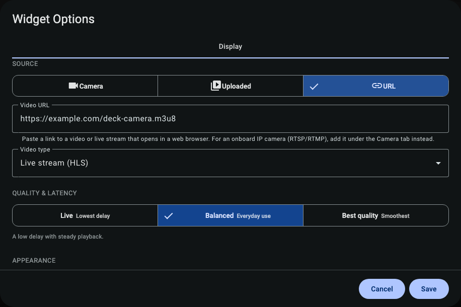
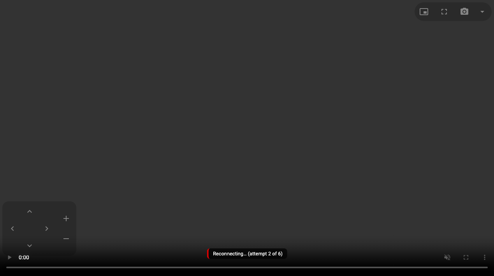

# Watching video

Once a camera is added, a few choices get you the best picture for the moment — smooth for everyday
watching, low-latency for docking. This guide also covers steering a pan/tilt/zoom (PTZ) camera and the
night/fog/glare picture presets.

---

## Delivery modes: smooth vs. low-latency

The same camera can be delivered to your browser three different ways. You pick one in the widget
settings under **Quality & Latency**.

  

| Mode                      | Best for                                     | Trade-off                                                                             |
| ------------------------- | -------------------------------------------- | ------------------------------------------------------------------------------------- |
| **Standard (HLS)**        | Everyday watching, weak networks             | A few seconds of delay, very reliable.                                                |
| **Low latency (WebRTC)**  | Docking, anchoring, watching someone on deck | Near-instant, but needs a healthier network.                                          |
| **Still refresh (MJPEG)** | Last resort on a very poor link              | A photo that refreshes every second or two — not smooth video, but it'll get through. |

**Rule of thumb:** start on **Standard (HLS)**. Switch to **Low latency (WebRTC)** when a second or two
of delay matters (you're maneuvering). If even HLS struggles on a bad satellite or cellular link, the
still-refresh mode keeps _something_ on screen.

> Apps that support it can walk these modes automatically — trying low-latency first and stepping down
> to still-refresh on a starved link, then recovering when the connection improves. The plugin exposes
> the information for that; see [Adaptive transport](../reference/capabilities.md#adaptive-transport)
> in the capability ledger.

---

## Moving a PTZ camera

If your camera supports **pan / tilt / zoom** (the plugin detects this automatically when you add it),
the widget shows on-screen controls. Drag or use the arrows to pan and tilt; use the zoom control to
zoom; the camera stops when you let go.

  

If the camera has **saved positions** ("presets") set up in its own app, those appear too — tap one to
send the camera there.

A PTZ camera that also reports **absolute positioning** can do more than be nudged around: it can be
pointed at a real-world position. That's what powers the man-overboard pointing and the AIS
"point at that ship" tool — see [Safety features](safety.md) and
[Advanced features](advanced.md).

---

## Night, fog & glare picture presets

Cameras that expose **imaging controls** over ONVIF (infrared cut, wide-dynamic-range, defog, focus,
brightness) get one-tap picture presets tuned for marine conditions:

| Preset         | Use it when                                                               |
| -------------- | ------------------------------------------------------------------------- |
| **Day**        | Normal daylight — the neutral baseline.                                   |
| **Night (IR)** | After dark — leans on the camera's infrared mode.                         |
| **Fog**        | Reduced visibility — turns on defog / contrast help if the camera has it. |
| **Glare**      | Bright sun on water — tames blown-out highlights.                         |

These are **best-effort** and **capability-gated**: the widget only offers a preset if the camera
actually supports the controls it needs, and a fixed-lens camera won't show focus options. They nudge
the camera's settings rather than fighting its automatic mode, so it's safe to experiment — set it back
to **Day** to return to neutral.

> Honesty check: a defog preset can't see through dense fog, and night/IR depends entirely on the
> camera's own hardware. These help the picture; they don't work miracles.

---

## Multiple cameras at once

Because cameras carry a **role** and **mount** (see [Adding cameras](cameras.md)), an app can arrange
them for you — group the docking cameras, put the anchor camera front-and-center, and so on. The plugin
publishes these grouping hints; the actual layout is up to the viewing app.

---

## Where to next

- **[Snapshots & recording](snapshots-and-recording.md)** — save a photo with your position on it, or
  record a camera to the boat.
- **[Safety features](safety.md)** — point cameras at a man-overboard position and capture anchor-watch
  evidence.
- **[Troubleshooting](troubleshooting.md)** — if the picture won't load or stalls.
