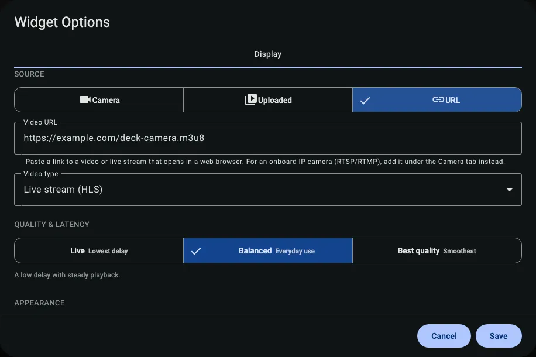
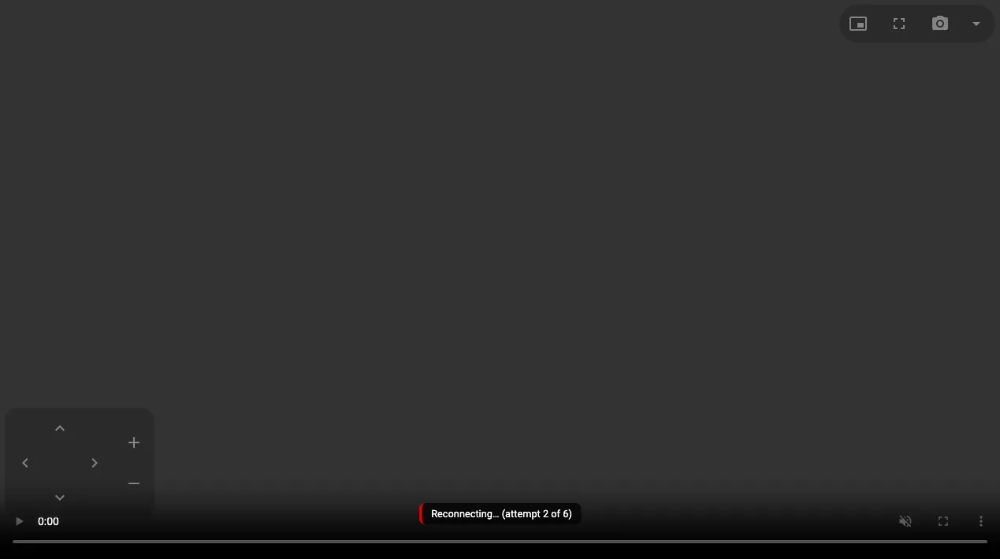

# Watching video

Once a camera is added, a few choices get you the best picture for the moment — smooth for everyday watching, low-latency for docking. This guide also covers steering a pan/tilt/zoom (PTZ) camera and the night/fog/glare picture presets.

> The controls below are in the **SK Video app** (open a camera in **Camera Focus** — see [The SK Video app](the-app.md)) and, if you prefer it, in KIP's Video widget. Both drive the same plugin.

---

## Delivery modes: smooth vs. low-latency

The same camera can be delivered to your browser three different ways. The SK Video app's player picks the best one automatically and walks down if the network can't sustain it; in KIP's widget you can force one under **Quality & Latency**.

  

| Mode | Best for | Trade-off |
| --- | --- | --- |
| **Standard (HLS)** | Everyday watching, weak networks | A few seconds of delay, very reliable. |
| **Low latency (WebRTC)** | Docking, anchoring, watching someone on deck | Near-instant, but needs a healthier network. |
| **Still refresh (MJPEG)** | Last resort on a very poor link | A photo that refreshes every second or two — not smooth video, but it'll get through. |

**Rule of thumb:** start on **Standard (HLS)**. Switch to **Low latency (WebRTC)** when a second or two of delay matters (you're maneuvering). If even HLS struggles on a bad satellite or cellular link, the still-refresh mode keeps _something_ on screen.

> Apps that support it can walk these modes automatically — trying low-latency first and stepping down to still-refresh on a starved link, then recovering when the connection improves. The plugin exposes the information for that; see [Adaptive transport](../reference/capabilities.md#adaptive-transport) in the capability ledger.

---

## Moving a PTZ camera

If your camera supports **pan / tilt / zoom** (the plugin detects this automatically when you add it), Camera Focus floats a set of glass controls over the video. The heart of it is a **joystick pad**: drag the centre knob to pan and tilt — the further you push, the faster it moves — or tap one of the four **chevrons** to nudge a step (hold to keep going). Beside it are a **zoom** pill (+ / −, with a live readout) and a red **STOP**. You can also just **drag on the video itself** to steer, pinch or scroll to zoom.

  

On a slow **still-refresh** feed, continuous panning is disabled on purpose — steering a 1-fps view near a dock is dangerous — and a note tells you why. If a move can't reach the camera, SK Video shows the **reason** ("can't reach the camera's ONVIF service — it may use a non-standard port", "the camera rejected the login", …) rather than a generic "try again", so you know what to fix. (A common one: a camera added by its RTSP address whose ONVIF service is on a different port — SK Video now probes the common ONVIF ports automatically, so this usually just works.)

If the camera has **saved positions** ("presets") set up in its own app, those appear in a **Presets** menu above the pad — tap one to send the camera there.

A PTZ camera that also reports **absolute positioning** can do more than be nudged around: it can be pointed at a real-world position. That's what powers the man-overboard pointing and the AIS "point at that ship" tool — see [Safety features](safety.md) and [Advanced features](advanced.md).

### Other Focus controls

Depending on what the camera reports, Camera Focus also offers:

- **Vision mode** — the picture presets below.
- **Stream** — switch between the full-resolution main and the lighter H.264 sub-stream, with the current codec and delivery mode shown.
- **Snapshot** and **Record** (recording is offered where the hardware tier and free recording channels allow).
- **Listen** and **Two-way audio** — hear the camera, or open a channel to hail through its speaker ([two-way audio](advanced.md#two-way-audio)).
- **Spotlight** and **Alarm** — a white-light spotlight or an audible siren, on cameras that expose one. Sounding the alarm asks you to confirm first.

---

## Night, fog & glare picture presets

Cameras that expose **imaging controls** over ONVIF (infrared-cut mode, brightness, contrast, colour saturation, sharpness, focus) get one-tap picture presets tuned for marine conditions, chosen from the **Vision** menu:

| Preset         | Use it when                                                                   |
| -------------- | ----------------------------------------------------------------------------- |
| **Auto**       | Hand the picture back to the camera's own automatic mode — the neutral reset. |
| **Day**        | Normal daylight.                                                              |
| **Night (IR)** | After dark — leans on the camera's infrared mode.                             |
| **Fog**        | Reduced visibility — lifts contrast and sharpness if the camera has them.     |
| **Glare**      | Bright sun on water — tames blown-out highlights.                             |

These are **best-effort** and **capability-gated**: a preset is only offered if the camera actually supports the controls it needs, and a fixed-lens camera won't show focus options. They nudge the camera's settings rather than fighting its automatic mode, so it's safe to experiment — pick **Auto** to hand control back to the camera.

> Honesty check: the Fog preset can't see through dense fog (there's no true defog control in the library it uses — it just lifts contrast and sharpness), and night/IR depends entirely on the camera's own hardware. These help the picture; they don't work miracles.

**Automatic after dark.** During a man-overboard or anchor/geofence alarm, SK Video checks the sun's position from the boat's location and time, and if it's past dusk it switches the imaging-capable cameras to the **Night (IR)** preset on its own — so the evidence and any camera aim are as clear as the hardware allows, with nobody at the screen. It only acts when the boat has a position fix and only on cameras that expose ONVIF imaging; everything else is left untouched. You can still change the preset by hand at any time.

---

## Multiple cameras at once

The SK Video app's **Live Wall** is a mosaic of every camera, arranged by where they're mounted (cameras carry a **role** and **mount** — see [Adding cameras](cameras.md)). To keep a wall of cameras smooth even on marina wifi, tiles use the lighter **sub-stream**, and each tile is honest about its state — connecting, live, never-seen, or gone dark — rather than showing a stale frame as if it were live. Tap a tile to open one camera in **Camera Focus**. (KIP can lay cameras out from the same grouping hints, too.)

---

## Where to next

- **[Snapshots & recording](snapshots-and-recording.md)** — save a photo with your position on it, or record a camera to the boat.
- **[Safety features](safety.md)** — point cameras at a man-overboard position and capture anchor-watch evidence.
- **[Troubleshooting](troubleshooting.md)** — if the picture won't load or stalls.
